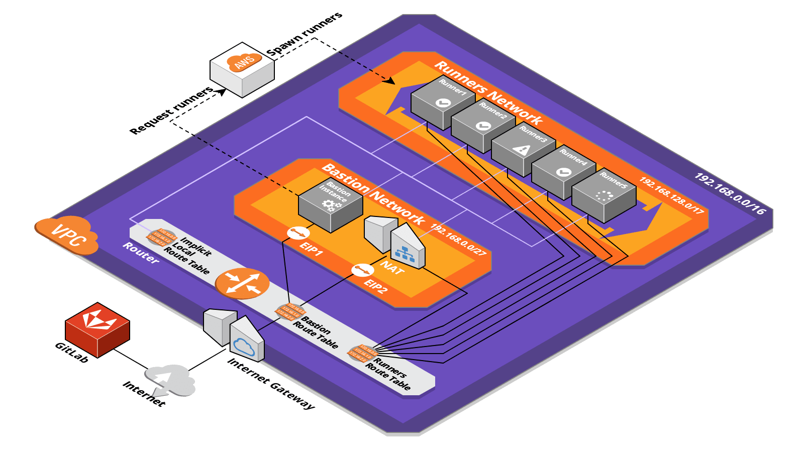

# GitLab Runner環境をCloudFormationでつくる

CloudFormationでGitLab Runner環境を作ったときのメモです。

## 前提

自分には以下の前提がありました。

1. GitLabはすでにEC2で動いている
2. 大きめのインスタンスを常時動かすともったいないのでAutoScalingしたい
3. GitLabはIPアドレス制限していて、そのレベルを下げたくない
4. GitLabのいるVPCはピアリング接続等でプライベートIPアドレスに空きがない

## AutoScaling

[GitLabのAWSでAutoScalingさせるドキュメント](https://docs.gitlab.com/runner/configuration/runner_autoscale_aws/)を読みました。

上のドキュメント内でbastion instanceと呼ばれているマシンがジョブ一覧をポーリングし、ジョブがあればアイドル状態のマシンを使って実行します。GitLabのpush ではなくbastion instanceのpullで動くところが重要です。[いつかFargate対応されそう](https://gitlab.com/gitlab-org/gitlab-runner/issues/2972)ですが2019年5月時点ではまだありません。

## 構成

[CloudCraft](https://cloudcraft.co/)で描いた図を載せます。IPv6対応もしてあるのですがIPv4と同じ構成なので省略しました。Bastionをパブリックサブネット、Runnerをプライベートサブネットに分けています。



図に入れられなかったセキュリティグループの設定はこちらです。

### Bastionインスタンス

|向き|プロトコル|ポート範囲|ソース|
|:----:|:----:|:----:|:----:|
|インバウンド|TCP|22|GitLab|
|アウトバウンド|すべて|すべて|すべて|

インバウンドの22番は問題が起きたときの`/var/log`の確認のために開けてあります。

### Runnerインスタンス

|向き|プロトコル|ポート範囲|ソース|
|:----:|:----:|:----:|:----:|
|インバウンド|TCP|2376|192.168.0.0/27（あとv6も）|
|アウトバウンド|すべて|すべて|すべて|

インバウンドの2376番はBastionインスタンスがDocker Daemonとの通信で使います。インバウンドソースはBastion Networkの CIDRです。

## chialab/aws-autoscaling-gitlab-runner

[chialab/aws-autoscaling-gitlab-runner/blob/master/runner.yml](https://github.com/chialab/aws-autoscaling-gitlab-runner/blob/master/runner.yml)

参考にしたテンプレートです。ロールの部分とBastionインスタンス（このテンプレートではManager）の部分で24時間分くらい助かりました。VPCを外から与えるのが自分のテンプレートと違うところです。

## CloudFormation

テンプレートを載せようと思ったのですがそうもいかないので、リソースの一覧を出して詰まったところをまとめます。

```yaml
CacheBucket: AWS::S3::Bucket
VPC: AWS::EC2::VPC
Ipv6VPCCidrBlock: AWS::EC2::VPCCidrBlock
InternetGateway: AWS::EC2::InternetGateway
GatewayAttachment: AWS::EC2::VPCGatewayAttachment
EgressOnlyInternetGateway: AWS::EC2::EgressOnlyInternetGateway

# Elastic IP
BastionEIP: AWS::EC2::EIP
AllowIngressFromGitLabRunnerBastion: AWS::EC2::SecurityGroupIngress
# → GitLabとの通信内容がわからないと何を許可すればいいのかわからない
NatEIP: AWS::EC2::EIP
AllowIngressFromGitLabRunnerNat: AWS::EC2::SecurityGroupIngress
# → GitLabとの通信内容がわからないと何を許可すればいいのかわからない

# Bastionサブネット関連のリソース
BastionSubnet: AWS::EC2::Subnet
BastionSubnetNatGateway: AWS::EC2::NatGateway
BastionSubnetRouteTable: AWS::EC2::RouteTable
BastionSubnetRouteV4: AWS::EC2::Route
BastionSubnetRouteV6: AWS::EC2::Route
BastionSubnetRouteTableAssociation: AWS::EC2::SubnetRouteTableAssociation
BastionSubnetAcl: AWS::EC2::NetworkAcl
# → VPCのネットワークの知識が不足していた
AllowIngressFromBastionSubnetToAllV4: AWS::EC2::NetworkAclEntry
AllowIngressFromBastionSubnetToAllV6: AWS::EC2::NetworkAclEntry
AllowEgressFromBastionSubnetToAllV4: AWS::EC2::NetworkAclEntry
AllowEgressFromBastionSubnetToAllV6: AWS::EC2::NetworkAclEntry
BastionSubnetAclAssociation: AWS::EC2::SubnetNetworkAclAssociation
BastionSecurityGroup: AWS::EC2::SecurityGroup
BastionInstanceRole: AWS::IAM::Role
BastionInstanceProfile: AWS::IAM::InstanceProfile
BastionInstance: AWS::EC2::Instance → AWS::CloudFormation::Initの設定
# → AWS::CloudFormation::Initの量が多い
# → パブリックIPアドレスの関連付けのタイミングで困った

# Runnerサブネット関連のリソース
RunnerSubnet: AWS::EC2::Subnet
RunnerSubnetRouteTable: AWS::EC2::RouteTable
RunnerSubnetRouteV4: AWS::EC2::Route
RunnerSubnetRouteV6: AWS::EC2::Route
RunnerSubnetRouteTableAssociation: AWS::EC2::SubnetRouteTableAssociation
RunnerSubnetAcl: AWS::EC2::NetworkAcl → ネットワーク
# → VPCのネットワークの知識が不足していた
AllowIngressFromBastionSubnetToRunnerSubnetV4: AWS::EC2::NetworkAclEntry
AllowIngressFromBastionSubnetToRunnerSubnetV6: AWS::EC2::NetworkAclEntry
AllowEgressFromRunnerSubnetToBastionSubnetV4: AWS::EC2::NetworkAclEntry
AllowEgressFromRunnerSubnetToBastionSubnetV6: AWS::EC2::NetworkAclEntry
RunnerSubnetAclAssociation: AWS::EC2::SubnetNetworkAclAssociation
RunnersSecurityGroup: AWS::EC2::SecurityGroup
RunnerRole: AWS::IAM::Role
RunnerInstanceProfile: AWS::IAM::InstanceProfile
```

スタックのパラメータでセキュリティグループidを渡して[SecurityGroupIngress](https://docs.aws.amazon.com/ja_jp/AWSCloudFormation/latest/UserGuide/aws-properties-ec2-security-group-ingress.html)で作成した２つのElastic IPからの接続を許可します。「どこを許可するのか」は下の詰まったところで後述します。

## 詰まったところ

### トークン

テンプレートで必要になるのはRunnerトークンで、これはGitLabの設定画面で確認できるRegistrationトークンとは別ですRunnerを登録した際に発行されるトークンなので、事前にGitLab APIでRunnerを登録してトークンを発行しておきます。トークンが間違っているとインスタンス作成時の疎通確認で失敗します。

### AWS::CloudFormation::Init

[AWS::CloudFormation::Init](https://docs.aws.amazon.com/ja_jp/AWSCloudFormation/latest/UserGuide/aws-resource-init.html)を使うと[cfn-init](https://docs.aws.amazon.com/ja_jp/AWSCloudFormation/latest/UserGuide/cfn-init.html)ができます。

> 1. AWS CloudFormation のメタデータの取得と解析
> 2. パッケージのインストール
> 3. ディスクへのファイルの書き込み
> 4. サービスの有効化/無効化と開始/停止

テンプレートの行数が一番多い部分になりましたが[先のリポジトリ](https://github.com/chialab/aws-autoscaling-gitlab-runner/blob/master/runner.yml)のおかげで楽ができました。

### ネットワーク

#### ネットワークACLとセキュリティグループの違い

これを把握できていなかったためACLのインバウンドを制限してしまいパッケージインストールなどの外部アクセスができなくなりました。[セキュリティグループとネットワークACLの比較](https://docs.aws.amazon.com/ja_jp/vpc/latest/userguide/VPC_Security.html#VPC_Security_Comparison)の以下の部分を読んで解決しました。

|セキュリティグループ|ネットワークACL|
|:----|:----|
|ステートフル：ルールに関係なく、返されたトラフィックが自動的に許可されます|ステートレス：返されたトラフィックがルールによって明示的に許可されます|

ACLのインバウンドを制限すると外部へのリクエストは通れますがレスポンスが通れません。外部アクセスが必要な場合ACLインバウンドは許可します。

#### パブリックIPアドレスの関連付け

Elastic IPの関連付けはインスタンスの作成後になります。Bastionインスタンスの作成中[AWS::CloudFormation::Init](https://docs.aws.amazon.com/ja_jp/AWSCloudFormation/latest/UserGuide/aws-resource-init.html)の設定でGitLabにリクエストを送るのですが、テンプレートで指定しているElastic IPはこの時点ではまだついていません。サブネット側で[MapPublicIpOnLaunch](https://docs.aws.amazon.com/ja_jp/AWSCloudFormation/latest/UserGuide/aws-resource-ec2-subnet.html#cfn-ec2-subnet-mappubliciponlaunch)をtrueにすると起動時にパブリックIPv4アドレスが割り当てられるのでcfn-init中も外部と通信できます。

ここまでの問題はAWSコンソールではBastionインスタンス作成時のエラーとして現れるためデバッグに時間がかかりました。

## GitLabとの通信内容

ジョブの中で特別なことをしない限りGitLabへの通信は以下の４種類です。

|送信元|ポート|内容|
|:----:|:----:|:----|
|Bastion|443|ジョブを引き受ける|
|Bastion|443|ジョブのログを送る|
|Bastion|443|ジョブの結果を送る|
|Runner (NAT)|443|リポジトリを GET する|

これらを止めないようにネットワークを設定すれば期待どおりに動作します。

## 動作確認

次のgitlab-ci.ymlのパイプラインを動かしてみます。

```yml
stages: [start, build, test, deploy]
start:
  stage: start
  script: echo start!
build-1:
  stage: build
  script: echo build-1!
  dependencies: [start]
build-2:
  stage: build
  script: echo build-2!
  dependencies: [start]
test-1:
  stage: test
  script: echo test-1!
  dependencies: [build-1]
test-2:
  stage: test
  script: echo test-2!
  dependencies: [build-2]
deploy:
  stage: deploy
  script: echo deploy!
  dependencies: [test-1, test-2]
```

### 結果


以下はログです。

1. 一度失敗したパイプラインなのでブラウザのリトライ要求で始まります
2. IPアドレスとホストはマスクしています
3. 日付は`[14/May/2019:03:27:45 +0000]`を`[03:27:45]`に短くしています

```text /var/log/gitlab/gitlab/nginx/gitlab_access.log
MyNAT     [03:27:45] "POST /GroupName/ProjectName/pipelines/10/retry.json HTTP/2.0" 204 0 "https://my-gitlab.example.com/GroupName/ProjectName/pipelines" "Mozilla/5.0 (Macintosh; Intel Mac OS X 10_14_4) AppleWebKit/537.36 (KHTML, like Gecko) Chrome/74.0.3729.131 Safari/537.36"
Bastion   [03:27:46] "POST /api/v4/jobs/request HTTP/1.1" 201 5373 "" "gitlab-runner 11.10.1 (11-10-stable; go1.8.7; linux/amd64)"
Bastion   [03:27:46] "POST /api/v4/jobs/request HTTP/1.1" 204 0 "" "gitlab-runner 11.10.1 (11-10-stable; go1.8.7; linux/amd64)"
Bastion   [03:27:49] "PATCH /api/v4/jobs/76/trace HTTP/1.1" 202 7 "" "gitlab-runner 11.10.1 (11-10-stable; go1.8.7; linux/amd64)"
Bastion   [03:28:19] "PUT /api/v4/jobs/76 HTTP/1.1" 200 4 "" "gitlab-runner 11.10.1 (11-10-stable; go1.8.7; linux/amd64)"
Bastion   [03:28:49] "PUT /api/v4/jobs/76 HTTP/1.1" 200 4 "" "gitlab-runner 11.10.1 (11-10-stable; go1.8.7; linux/amd64)"
Bastion   [03:28:58] "PATCH /api/v4/jobs/76/trace HTTP/1.1" 202 7 "" "gitlab-runner 11.10.1 (11-10-stable; go1.8.7; linux/amd64)"
Bastion   [03:29:01] "PATCH /api/v4/jobs/76/trace HTTP/1.1" 202 7 "" "gitlab-runner 11.10.1 (11-10-stable; go1.8.7; linux/amd64)"
RunnerNAT [03:29:05] "GET /GroupName/ProjectName.git/info/refs?service=git-upload-pack HTTP/2.0" 401 26 "" "git/2.20.1"
RunnerNAT - gitlab-ci-token [03:29:06] "GET /GroupName/ProjectName.git/info/refs?service=git-upload-pack HTTP/2.0" 200 351 "" "git/2.20.1"
RunnerNAT - gitlab-ci-token [03:29:06] "POST /GroupName/ProjectName.git/git-upload-pack HTTP/2.0" 200 83164 "" "git/2.20.1"
Bastion   [03:29:07] "PATCH /api/v4/jobs/76/trace HTTP/1.1" 202 8 "" "gitlab-runner 11.10.1 (11-10-stable; go1.8.7; linux/amd64)"
Bastion   [03:29:10] "PATCH /api/v4/jobs/76/trace HTTP/1.1" 202 8 "" "gitlab-runner 11.10.1 (11-10-stable; go1.8.7; linux/amd64)"
Bastion   [03:29:13] "PATCH /api/v4/jobs/76/trace HTTP/1.1" 202 8 "" "gitlab-runner 11.10.1 (11-10-stable; go1.8.7; linux/amd64)"
Bastion   [03:29:14] "PATCH /api/v4/jobs/76/trace HTTP/1.1" 202 8 "" "gitlab-runner 11.10.1 (11-10-stable; go1.8.7; linux/amd64)"
Bastion   [03:29:14] "PUT /api/v4/jobs/76 HTTP/1.1" 200 4 "" "gitlab-runner 11.10.1 (11-10-stable; go1.8.7; linux/amd64)"
Bastion   [03:29:16] "POST /api/v4/jobs/request HTTP/1.1" 201 5436 "" "gitlab-runner 11.10.1 (11-10-stable; go1.8.7; linux/amd64)"
Bastion   [03:29:16] "POST /api/v4/jobs/request HTTP/1.1" 201 5436 "" "gitlab-runner 11.10.1 (11-10-stable; go1.8.7; linux/amd64)"
Bastion   [03:29:19] "PATCH /api/v4/jobs/57/trace HTTP/1.1" 202 7 "" "gitlab-runner 11.10.1 (11-10-stable; go1.8.7; linux/amd64)"
Bastion   [03:29:19] "PATCH /api/v4/jobs/58/trace HTTP/1.1" 202 7 "" "gitlab-runner 11.10.1 (11-10-stable; go1.8.7; linux/amd64)"
Bastion   [03:29:22] "PATCH /api/v4/jobs/57/trace HTTP/1.1" 202 7 "" "gitlab-runner 11.10.1 (11-10-stable; go1.8.7; linux/amd64)"
RunnerNAT [03:29:22] "GET /GroupName/ProjectName.git/info/refs?service=git-upload-pack HTTP/2.0" 401 26 "" "git/2.20.1"
RunnerNAT - gitlab-ci-token [03:29:22] "GET /GroupName/ProjectName.git/info/refs?service=git-upload-pack HTTP/2.0" 200 351 "" "git/2.20.1"
RunnerNAT - gitlab-ci-token [03:29:22] "POST /GroupName/ProjectName.git/git-upload-pack HTTP/2.0" 200 83164 "" "git/2.20.1"
Bastion   [03:29:25] "PATCH /api/v4/jobs/57/trace HTTP/1.1" 202 8 "" "gitlab-runner 11.10.1 (11-10-stable; go1.8.7; linux/amd64)"
Bastion   [03:29:28] "PATCH /api/v4/jobs/57/trace HTTP/1.1" 202 8 "" "gitlab-runner 11.10.1 (11-10-stable; go1.8.7; linux/amd64)"
Bastion   [03:29:31] "PATCH /api/v4/jobs/57/trace HTTP/1.1" 202 8 "" "gitlab-runner 11.10.1 (11-10-stable; go1.8.7; linux/amd64)"
Bastion   [03:29:31] "PATCH /api/v4/jobs/57/trace HTTP/1.1" 202 8 "" "gitlab-runner 11.10.1 (11-10-stable; go1.8.7; linux/amd64)"
Bastion   [03:29:31] "PUT /api/v4/jobs/57 HTTP/1.1" 200 4 "" "gitlab-runner 11.10.1 (11-10-stable; go1.8.7; linux/amd64)"
Bastion   [03:29:33] "POST /api/v4/jobs/request HTTP/1.1" 204 0 "" "gitlab-runner 11.10.1 (11-10-stable; go1.8.7; linux/amd64)"
Bastion   [03:29:36] "POST /api/v4/jobs/request HTTP/1.1" 204 0 "" "gitlab-runner 11.10.1 (11-10-stable; go1.8.7; linux/amd64)"
Bastion   [03:29:39] "POST /api/v4/jobs/request HTTP/1.1" 204 0 "" "gitlab-runner 11.10.1 (11-10-stable; go1.8.7; linux/amd64)"
Bastion   [03:29:42] "POST /api/v4/jobs/request HTTP/1.1" 204 0 "" "gitlab-runner 11.10.1 (11-10-stable; go1.8.7; linux/amd64)"
Bastion   [03:29:45] "POST /api/v4/jobs/request HTTP/1.1" 204 0 "" "gitlab-runner 11.10.1 (11-10-stable; go1.8.7; linux/amd64)"
Bastion   [03:29:48] "POST /api/v4/jobs/request HTTP/1.1" 204 0 "" "gitlab-runner 11.10.1 (11-10-stable; go1.8.7; linux/amd64)"
Bastion   [03:29:49] "PUT /api/v4/jobs/58 HTTP/1.1" 200 4 "" "gitlab-runner 11.10.1 (11-10-stable; go1.8.7; linux/amd64)"
Bastion   [03:29:51] "POST /api/v4/jobs/request HTTP/1.1" 204 0 "" "gitlab-runner 11.10.1 (11-10-stable; go1.8.7; linux/amd64)"
Bastion   [03:29:54] "POST /api/v4/jobs/request HTTP/1.1" 204 0 "" "gitlab-runner 11.10.1 (11-10-stable; go1.8.7; linux/amd64)"
Bastion   [03:29:57] "POST /api/v4/jobs/request HTTP/1.1" 204 0 "" "gitlab-runner 11.10.1 (11-10-stable; go1.8.7; linux/amd64)"
Bastion   [03:30:00] "POST /api/v4/jobs/request HTTP/1.1" 204 0 "" "gitlab-runner 11.10.1 (11-10-stable; go1.8.7; linux/amd64)"
Bastion   [03:30:03] "POST /api/v4/jobs/request HTTP/1.1" 204 0 "" "gitlab-runner 11.10.1 (11-10-stable; go1.8.7; linux/amd64)"
Bastion   [03:30:06] "POST /api/v4/jobs/request HTTP/1.1" 204 0 "" "gitlab-runner 11.10.1 (11-10-stable; go1.8.7; linux/amd64)"
Bastion   [03:30:09] "POST /api/v4/jobs/request HTTP/1.1" 204 0 "" "gitlab-runner 11.10.1 (11-10-stable; go1.8.7; linux/amd64)"
Bastion   [03:30:12] "POST /api/v4/jobs/request HTTP/1.1" 204 0 "" "gitlab-runner 11.10.1 (11-10-stable; go1.8.7; linux/amd64)"
Bastion   [03:30:15] "POST /api/v4/jobs/request HTTP/1.1" 204 0 "" "gitlab-runner 11.10.1 (11-10-stable; go1.8.7; linux/amd64)"
Bastion   [03:30:18] "POST /api/v4/jobs/request HTTP/1.1" 204 0 "" "gitlab-runner 11.10.1 (11-10-stable; go1.8.7; linux/amd64)"
Bastion   [03:30:19] "PUT /api/v4/jobs/58 HTTP/1.1" 200 4 "" "gitlab-runner 11.10.1 (11-10-stable; go1.8.7; linux/amd64)"
Bastion   [03:30:21] "POST /api/v4/jobs/request HTTP/1.1" 204 0 "" "gitlab-runner 11.10.1 (11-10-stable; go1.8.7; linux/amd64)"
Bastion   [03:30:24] "POST /api/v4/jobs/request HTTP/1.1" 204 0 "" "gitlab-runner 11.10.1 (11-10-stable; go1.8.7; linux/amd64)"
Bastion   [03:30:27] "POST /api/v4/jobs/request HTTP/1.1" 204 0 "" "gitlab-runner 11.10.1 (11-10-stable; go1.8.7; linux/amd64)"
Bastion   [03:30:30] "POST /api/v4/jobs/request HTTP/1.1" 204 0 "" "gitlab-runner 11.10.1 (11-10-stable; go1.8.7; linux/amd64)"
Bastion   [03:30:31] "PATCH /api/v4/jobs/58/trace HTTP/1.1" 202 7 "" "gitlab-runner 11.10.1 (11-10-stable; go1.8.7; linux/amd64)"
Bastion   [03:30:33] "POST /api/v4/jobs/request HTTP/1.1" 204 0 "" "gitlab-runner 11.10.1 (11-10-stable; go1.8.7; linux/amd64)"
Bastion   [03:30:34] "PATCH /api/v4/jobs/58/trace HTTP/1.1" 202 7 "" "gitlab-runner 11.10.1 (11-10-stable; go1.8.7; linux/amd64)"
Bastion   [03:30:36] "POST /api/v4/jobs/request HTTP/1.1" 204 0 "" "gitlab-runner 11.10.1 (11-10-stable; go1.8.7; linux/amd64)"
Bastion   [03:30:37] "PATCH /api/v4/jobs/58/trace HTTP/1.1" 202 7 "" "gitlab-runner 11.10.1 (11-10-stable; go1.8.7; linux/amd64)"
RunnerNAT [03:30:38] "GET /GroupName/ProjectName.git/info/refs?service=git-upload-pack HTTP/2.0" 401 26 "" "git/2.20.1"
RunnerNAT - gitlab-ci-token [03:30:38] "GET /GroupName/ProjectName.git/info/refs?service=git-upload-pack HTTP/2.0" 200 351 "" "git/2.20.1"
RunnerNAT - gitlab-ci-token [03:30:38] "POST /GroupName/ProjectName.git/git-upload-pack HTTP/2.0" 200 83164 "" "git/2.20.1"
Bastion   [03:30:39] "POST /api/v4/jobs/request HTTP/1.1" 204 0 "" "gitlab-runner 11.10.1 (11-10-stable; go1.8.7; linux/amd64)"
Bastion   [03:30:40] "PATCH /api/v4/jobs/58/trace HTTP/1.1" 202 8 "" "gitlab-runner 11.10.1 (11-10-stable; go1.8.7; linux/amd64)"
Bastion   [03:30:42] "POST /api/v4/jobs/request HTTP/1.1" 204 0 "" "gitlab-runner 11.10.1 (11-10-stable; go1.8.7; linux/amd64)"
Bastion   [03:30:43] "PATCH /api/v4/jobs/58/trace HTTP/1.1" 202 8 "" "gitlab-runner 11.10.1 (11-10-stable; go1.8.7; linux/amd64)"
Bastion   [03:30:45] "POST /api/v4/jobs/request HTTP/1.1" 204 0 "" "gitlab-runner 11.10.1 (11-10-stable; go1.8.7; linux/amd64)"
Bastion   [03:30:46] "PATCH /api/v4/jobs/58/trace HTTP/1.1" 202 8 "" "gitlab-runner 11.10.1 (11-10-stable; go1.8.7; linux/amd64)"
Bastion   [03:30:46] "PATCH /api/v4/jobs/58/trace HTTP/1.1" 202 8 "" "gitlab-runner 11.10.1 (11-10-stable; go1.8.7; linux/amd64)"
Bastion   [03:30:46] "PUT /api/v4/jobs/58 HTTP/1.1" 200 4 "" "gitlab-runner 11.10.1 (11-10-stable; go1.8.7; linux/amd64)"
Bastion   [03:30:49] "POST /api/v4/jobs/request HTTP/1.1" 201 5431 "" "gitlab-runner 11.10.1 (11-10-stable; go1.8.7; linux/amd64)"
Bastion   [03:30:49] "POST /api/v4/jobs/request HTTP/1.1" 201 5431 "" "gitlab-runner 11.10.1 (11-10-stable; go1.8.7; linux/amd64)"
Bastion   [03:30:52] "PATCH /api/v4/jobs/59/trace HTTP/1.1" 202 7 "" "gitlab-runner 11.10.1 (11-10-stable; go1.8.7; linux/amd64)"
Bastion   [03:30:52] "PATCH /api/v4/jobs/60/trace HTTP/1.1" 202 7 "" "gitlab-runner 11.10.1 (11-10-stable; go1.8.7; linux/amd64)"
Bastion   [03:30:55] "PATCH /api/v4/jobs/59/trace HTTP/1.1" 202 7 "" "gitlab-runner 11.10.1 (11-10-stable; go1.8.7; linux/amd64)"
Bastion   [03:30:55] "PATCH /api/v4/jobs/60/trace HTTP/1.1" 202 7 "" "gitlab-runner 11.10.1 (11-10-stable; go1.8.7; linux/amd64)"
RunnerNAT [03:30:55] "GET /GroupName/ProjectName.git/info/refs?service=git-upload-pack HTTP/2.0" 401 26 "" "git/2.20.1"
RunnerNAT - gitlab-ci-token [03:30:55] "GET /GroupName/ProjectName.git/info/refs?service=git-upload-pack HTTP/2.0" 200 351 "" "git/2.20.1"
RunnerNAT - gitlab-ci-token [03:30:55] "POST /GroupName/ProjectName.git/git-upload-pack HTTP/2.0" 200 83169 "" "git/2.20.1"
RunnerNAT [03:30:55] "GET /GroupName/ProjectName.git/info/refs?service=git-upload-pack HTTP/2.0" 401 26 "" "git/2.20.1"
RunnerNAT - gitlab-ci-token [03:30:55] "GET /GroupName/ProjectName.git/info/refs?service=git-upload-pack HTTP/2.0" 200 351 "" "git/2.20.1"
RunnerNAT - gitlab-ci-token [03:30:56] "POST /GroupName/ProjectName.git/git-upload-pack HTTP/2.0" 200 83164 "" "git/2.20.1"
Bastion   [03:30:58] "PATCH /api/v4/jobs/59/trace HTTP/1.1" 202 8 "" "gitlab-runner 11.10.1 (11-10-stable; go1.8.7; linux/amd64)"
Bastion   [03:30:58] "PATCH /api/v4/jobs/60/trace HTTP/1.1" 202 8 "" "gitlab-runner 11.10.1 (11-10-stable; go1.8.7; linux/amd64)"
Bastion   [03:31:01] "PATCH /api/v4/jobs/59/trace HTTP/1.1" 202 8 "" "gitlab-runner 11.10.1 (11-10-stable; go1.8.7; linux/amd64)"
Bastion   [03:31:01] "PATCH /api/v4/jobs/60/trace HTTP/1.1" 202 8 "" "gitlab-runner 11.10.1 (11-10-stable; go1.8.7; linux/amd64)"
Bastion   [03:31:04] "PATCH /api/v4/jobs/59/trace HTTP/1.1" 202 8 "" "gitlab-runner 11.10.1 (11-10-stable; go1.8.7; linux/amd64)"
Bastion   [03:31:04] "PATCH /api/v4/jobs/60/trace HTTP/1.1" 202 8 "" "gitlab-runner 11.10.1 (11-10-stable; go1.8.7; linux/amd64)"
Bastion   [03:31:04] "PATCH /api/v4/jobs/59/trace HTTP/1.1" 202 8 "" "gitlab-runner 11.10.1 (11-10-stable; go1.8.7; linux/amd64)"
Bastion   [03:31:04] "PUT /api/v4/jobs/59 HTTP/1.1" 200 4 "" "gitlab-runner 11.10.1 (11-10-stable; go1.8.7; linux/amd64)"
Bastion   [03:31:04] "PATCH /api/v4/jobs/60/trace HTTP/1.1" 202 8 "" "gitlab-runner 11.10.1 (11-10-stable; go1.8.7; linux/amd64)"
Bastion   [03:31:04] "PUT /api/v4/jobs/60 HTTP/1.1" 200 4 "" "gitlab-runner 11.10.1 (11-10-stable; go1.8.7; linux/amd64)"
Bastion   [03:31:07] "POST /api/v4/jobs/request HTTP/1.1" 201 5493 "" "gitlab-runner 11.10.1 (11-10-stable; go1.8.7; linux/amd64)"
Bastion   [03:31:07] "POST /api/v4/jobs/request HTTP/1.1" 204 0 "" "gitlab-runner 11.10.1 (11-10-stable; go1.8.7; linux/amd64)"
Bastion   [03:31:09] "POST /api/v4/jobs/request HTTP/1.1" 204 0 "" "gitlab-runner 11.10.1 (11-10-stable; go1.8.7; linux/amd64)"
Bastion   [03:31:10] "PATCH /api/v4/jobs/61/trace HTTP/1.1" 202 7 "" "gitlab-runner 11.10.1 (11-10-stable; go1.8.7; linux/amd64)"
Bastion   [03:31:12] "POST /api/v4/jobs/request HTTP/1.1" 204 0 "" "gitlab-runner 11.10.1 (11-10-stable; go1.8.7; linux/amd64)"
Bastion   [03:31:13] "PATCH /api/v4/jobs/61/trace HTTP/1.1" 202 7 "" "gitlab-runner 11.10.1 (11-10-stable; go1.8.7; linux/amd64)"
RunnerNAT [03:31:13] "GET /GroupName/ProjectName.git/info/refs?service=git-upload-pack HTTP/2.0" 401 26 "" "git/2.20.1"
RunnerNAT - gitlab-ci-token [03:31:13] "GET /GroupName/ProjectName.git/info/refs?service=git-upload-pack HTTP/2.0" 200 351 "" "git/2.20.1"
RunnerNAT - gitlab-ci-token [03:31:13] "POST /GroupName/ProjectName.git/git-upload-pack HTTP/2.0" 200 83164 "" "git/2.20.1"
Bastion   [03:31:15] "POST /api/v4/jobs/request HTTP/1.1" 204 0 "" "gitlab-runner 11.10.1 (11-10-stable; go1.8.7; linux/amd64)"
Bastion   [03:31:16] "PATCH /api/v4/jobs/61/trace HTTP/1.1" 202 8 "" "gitlab-runner 11.10.1 (11-10-stable; go1.8.7; linux/amd64)"
Bastion   [03:31:18] "POST /api/v4/jobs/request HTTP/1.1" 204 0 "" "gitlab-runner 11.10.1 (11-10-stable; go1.8.7; linux/amd64)"
Bastion   [03:31:19] "PATCH /api/v4/jobs/61/trace HTTP/1.1" 202 8 "" "gitlab-runner 11.10.1 (11-10-stable; go1.8.7; linux/amd64)"
Bastion   [03:31:21] "POST /api/v4/jobs/request HTTP/1.1" 204 0 "" "gitlab-runner 11.10.1 (11-10-stable; go1.8.7; linux/amd64)"
Bastion   [03:31:22] "PATCH /api/v4/jobs/61/trace HTTP/1.1" 202 8 "" "gitlab-runner 11.10.1 (11-10-stable; go1.8.7; linux/amd64)"
Bastion   [03:31:22] "PATCH /api/v4/jobs/61/trace HTTP/1.1" 202 8 "" "gitlab-runner 11.10.1 (11-10-stable; go1.8.7; linux/amd64)"
Bastion   [03:31:22] "PUT /api/v4/jobs/61 HTTP/1.1" 200 4 "" "gitlab-runner 11.10.1 (11-10-stable; go1.8.7; linux/amd64)"
Bastion   [03:31:24] "POST /api/v4/jobs/request HTTP/1.1" 204 0 "" "gitlab-runner 11.10.1 (11-10-stable; go1.8.7; linux/amd64)"
Bastion   [03:31:27] "POST /api/v4/jobs/request HTTP/1.1" 204 0 "" "gitlab-runner 11.10.1 (11-10-stable; go1.8.7; linux/amd64)"
Bastion   [03:31:30] "POST /api/v4/jobs/request HTTP/1.1" 204 0 "" "gitlab-runner 11.10.1 (11-10-stable; go1.8.7; linux/amd64)"
```

IdleTimeを300秒、IdleCountを0に設定していたため、2台のマシンは5分後にそれぞれシャットダウンされました。

ジョブ57と58は同じステージなので並行に実行されるはずですが、58は57 よりも後に実行されています。これはBuildステージに入った時にアイドル状態だったマシンがジョブ76を実行していた1台だけだったからです。ジョブ57は既存マシンに割り当てられたため開始が早く、ジョブ58は新しいマシンの起動を待つため開始が遅れました。次のTestステージではBuildステージで使った2台のマシンがアイドル状態で存在していたので同時に始まっています。
