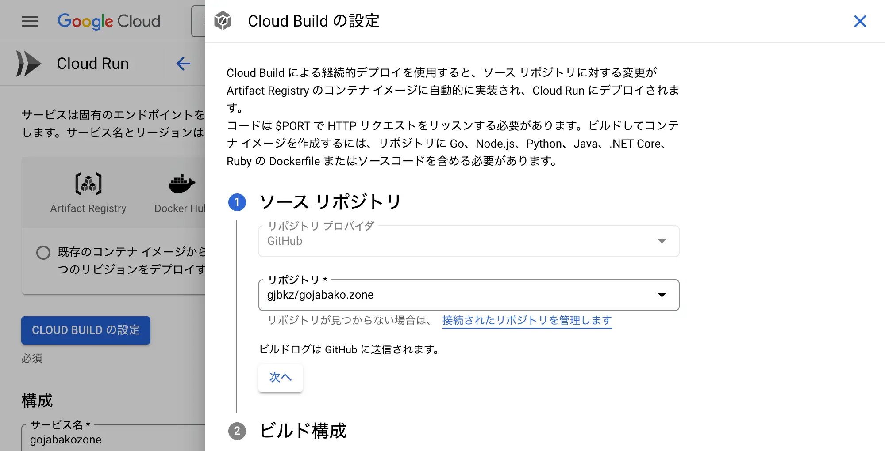
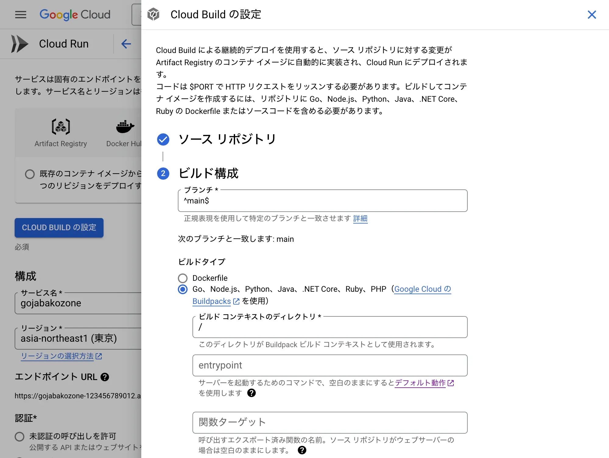
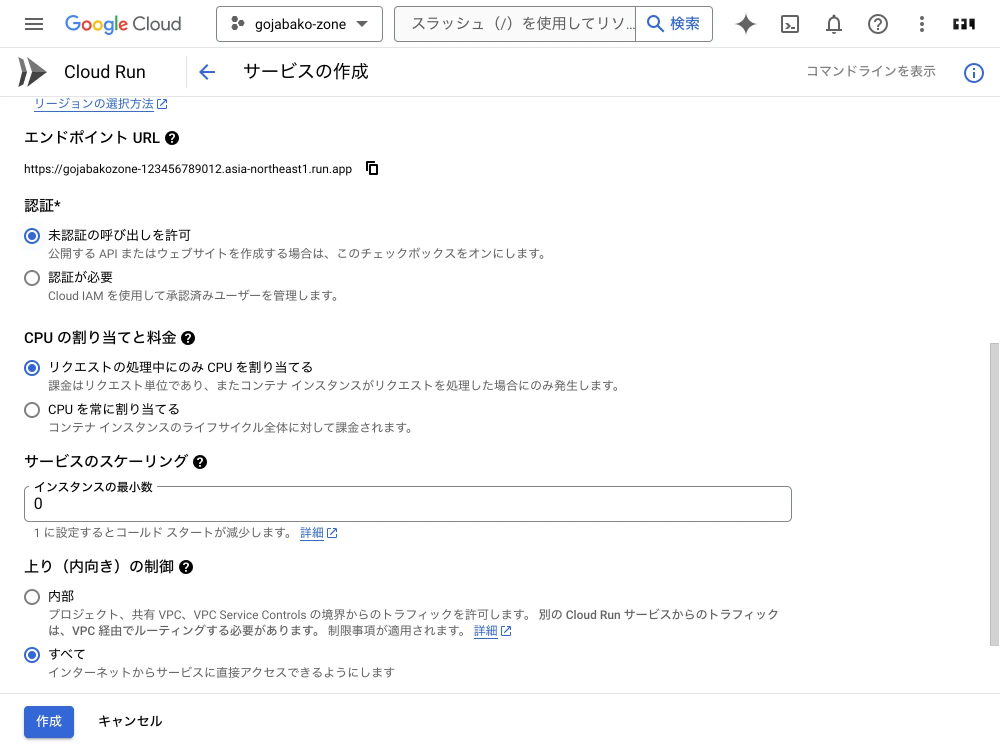
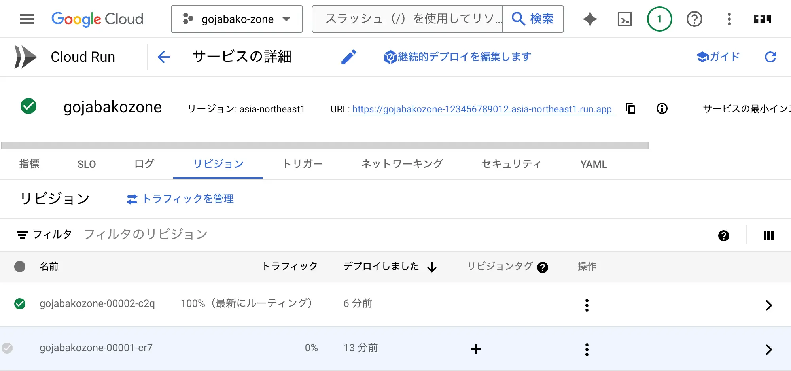

export const metadata = {
  title: 'Cloud Run, Amplify, Netlify, VercelにNext.jsをデプロイ',
  description: 'このブログを複数のサービスでホストするようにしました。',
};

このブログをCloud Run, Amplify, Netlify, Vercelでホストするようにしました。DNS (Route 53) でリクエストを振り分けています。

このページがどのホストから提供されているかはページ最下部左側を確認してください。

## GCP Cloud Run

## AWS Amplify
