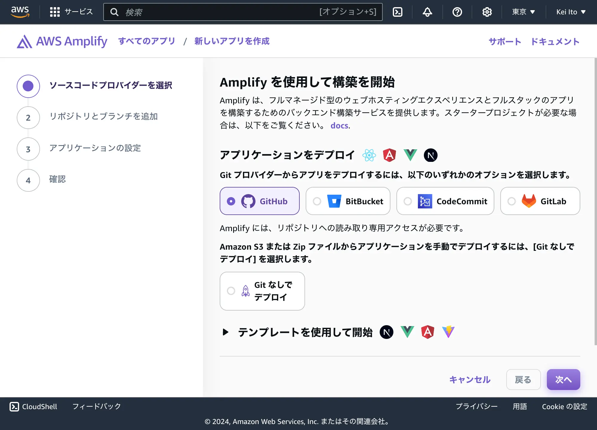
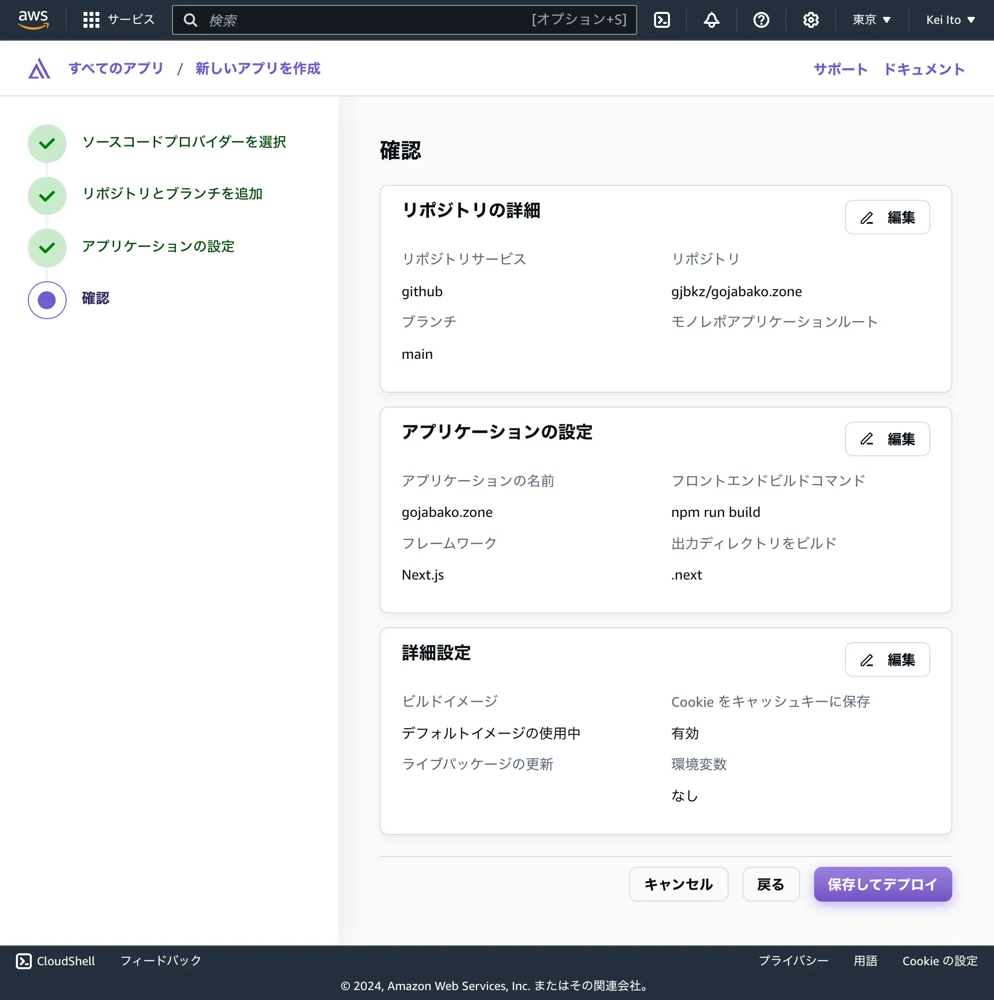
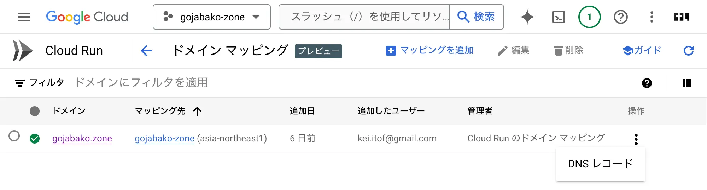
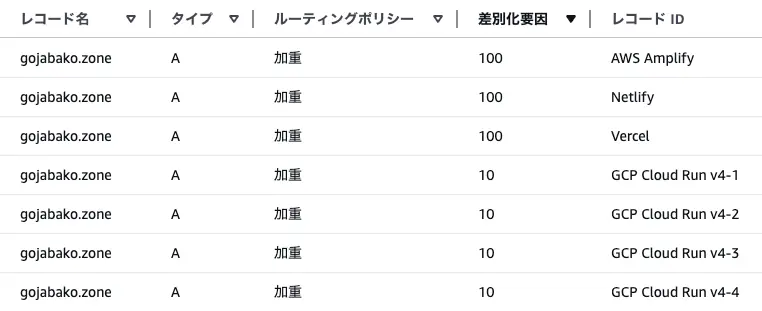
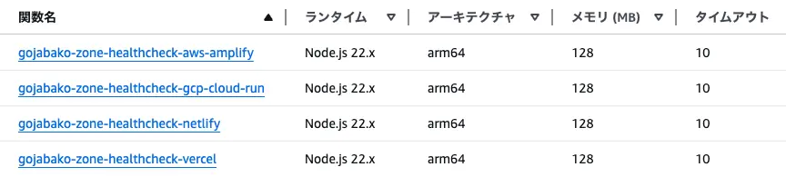
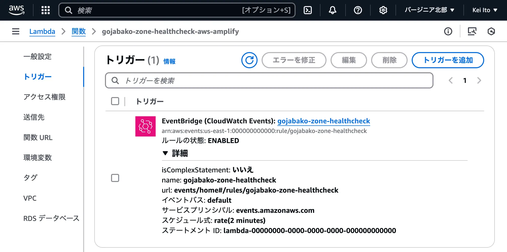
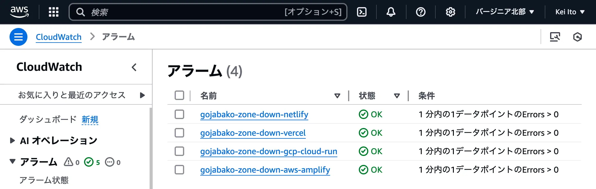
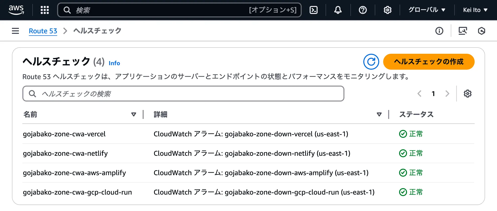

export const metadata = {
  title: 'Cloud Run, Amplify, Netlify, VercelにNext.jsをデプロイ',
  description: 'このブログを複数のサービスで運用するようにしました。',
};

このブログをCloud Run, AWS Amplify, Netlify, Vercelで運用するようにしました。DNS (Route 53) でリクエストを振り分けています。

## デプロイ

総じてデプロイは簡単だったので特に言うことはありません。

### Cloud Run


### AWS Amplify





### Netlify, Vercel

ログインしてリポジトリを選ぶだけなので省略します。

## ドメイン設定

4つデプロイしたので、全部使うことにしました。

### Cloud Run

Cloud Runのサービス一覧画面で「カスタムドメインを管理」から追加します。



### AWS Amplify

「アプリケーションの概要」→「ホスティング」→「カスタムドメイン」で設定します。

### Netlify, Vercel

Netlifyは「Domain management」、Vercelは「Settings」→「Domains」で設定します。

## ドメイン設定

それぞれに分散させたいので、Route 53で [加重ルーティング](https://docs.aws.amazon.com/ja_jp/Route53/latest/DeveloperGuide/routing-policy-weighted.html) しました。



## ヘルスチェック

Route 53でヘルスチェックを設定し正常でないエンドポイントはを返さないようにしました。

1. middleware.ts で GET /health に 200 を返すようにします。
2. それぞれの `https://mainブランチデプロイ先/health` が動いているか確認します。
3. Route 53のヘルスチェックを設定して終わりです。Route 53の料金は2024年12月時点で以下の通りです。

](./route5302.webp)

AWS以外のエンドポイントにHTTPSでヘルスチェックすると1エンドポイント 2.75USD/月 です。ちょっともったいないのでCloudWatchアラームで節約できるか試してみました。

まず、Lambda関数を追加します。

```javascript
const HealthCheckUrl = 'https://mainブランチデプロイ先/health';
const TimeoutMs = 8000;
export const handler = async () => {
  const abc = new AbortController();
  const timerId = setTimeout(() => abc.abort(), TimeoutMs);
  try {
    const res = await fetch(HealthCheckUrl, {signal: abc.signal});
    if (!res.ok) {
      throw new Error(`${res.status} ${res.statusText}`)
    }
  } catch (error) {
    if (error.name === 'AbortError') {
      throw new Error(`Request timed out after ${TimeoutMs}ms`);
    }
    throw error;
  } finally {
    clearTimeout(timerId);
  }
};
```



関数はEventBridgeで定期実行します。



エラーを検知するCloudWatchアラームを作成します。



CloudWatchアラームを見るタイプのヘルスチェックを作成し、レコードのヘルスチェックのところに設定します。



この場合の1エンドポイントあたりの料金を試算してみます。

- $C_E$: EventBridgeの料金 ... よくわからないのでゼロ！
- $C_L$: Lambdaの料金
   - $N$: 2分ごと実行とすると 720回/日、31日で22320回実行されます。
   - $T$: 1回の実行時間は Cloud Run 240ms, AWS Ampliy 600ms, Netlify 200ms, Vercel 180ms くらいなので多めに見積もって 1000ms/回 とします。
   - $C$: 2024年12月の us-east-1 Arm 128MB の料金は 0.0000000017 USD/ms です。
   - $N\times T\times C=0.0000000017\times 1000\times 22320=0.038$ USD/月 となります。
- $C_W$: CloudWatchの料金 ... 1アラーム 0.10USD/月 です。
- $C_D$: Route 53の料金 ... 1ヘルスチェック 0.50USD/月 です。
- $C=C_E+C_L+C_W+C_D=0+0.038+0.10+0.50=0.64$ USD/月 です。

Route 53でAWS外部のHTTPSだと 2.75USD/月 になりそうなので、1/4にできそうです。実際のところは来月の請求をみて確認します。

## このページはどこから？

閲覧時にレスポンスをどこが返したのか確認したいのでフッター左側に表示するようにしました。


これをやるのに環境変数をいろいろいじったのですが、それは別の記事にします。
