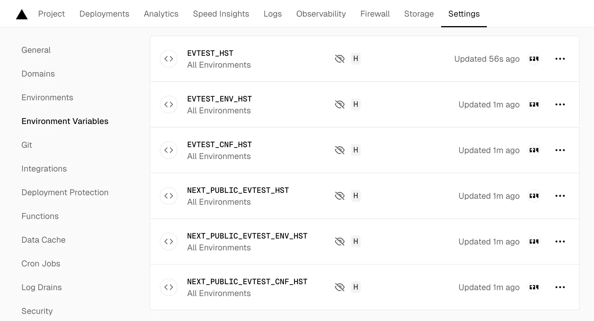
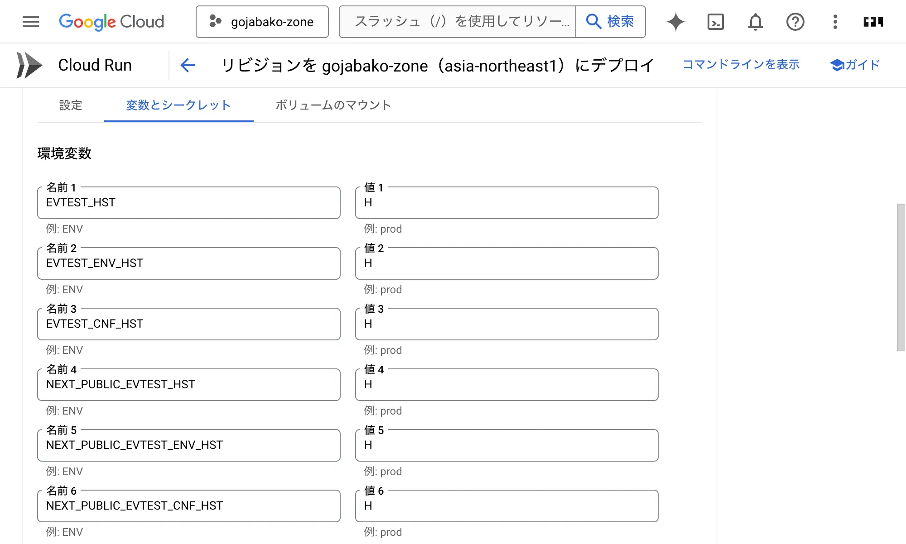
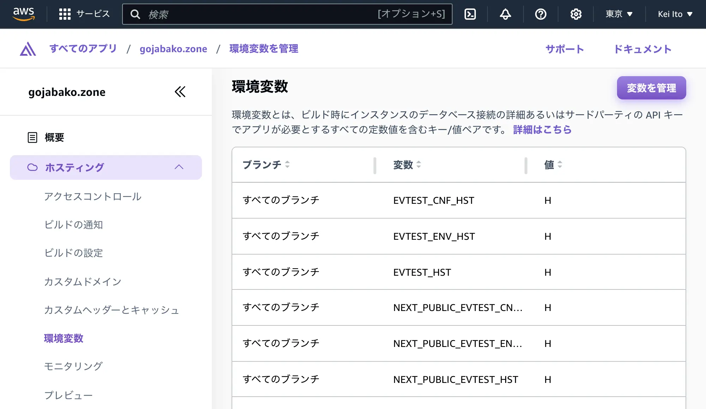
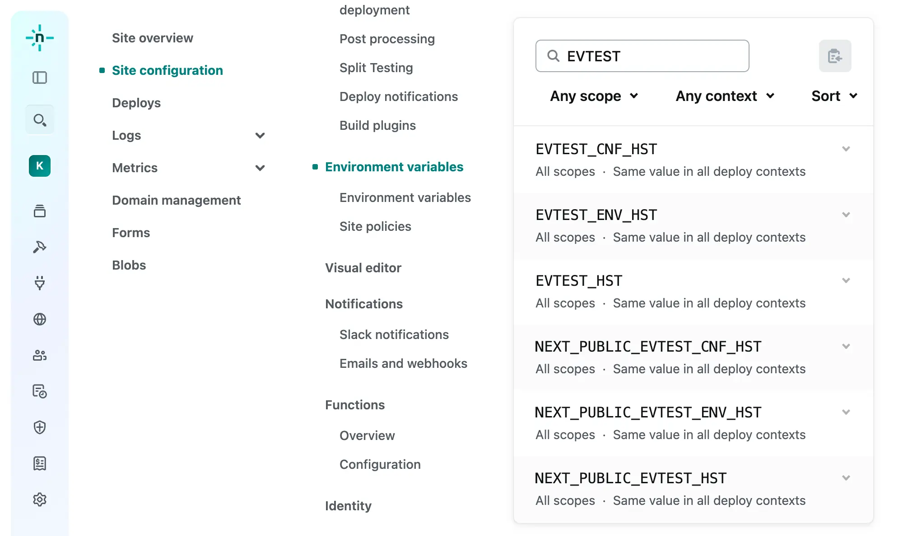

export const metadata = {
  title: 'Cloud Run, Amplify, Netlify, Vercel上のNext.js環境変数事情',
  description: '環境変数はどのタイミングで何が使えるのかを検証しました。',
  keywords: ["Next.js", "Vercel", "GCP", "Cloud Run", "AWS", "Amplify", "Netlify", "環境変数", "Environment Variables"],
};
import { EnvTestApi } from "./EnvTestApi.tsx";
import { EnvTestSsr } from "./EnvTestSsr.tsx";
import { EnvTestClient } from "./EnvTestClient.tsx";
import { EnvTestTable } from "./EnvTestTable.tsx";
import { EnvTestSummary } from "./EnvTestSummary.tsx";
import { RefId } from "./refId.ts";
import { IconClass } from "../../../../util/classnames";
import * as style from "./style.module.scss";

[前の記事](./multi-cloud)で環境を複数にしたのでログをNewRelicに集めようとしたら環境変数が素直に渡らないことがあったので実験しました。

## 検証したいこと

以下の2点です。

1. [.envファイル]、[next.config.js]、Vercel等の設定画面の設定値はどれが勝つのか？
2. middleware、サーバー、クライアントでどの環境変数が使えるのか？

[.envファイル]: https://nextjs.org/docs/app/building-your-application/configuring/environment-variables
[next.config.js]: https://nextjs.org/docs/app/api-reference/next-config-js/env

## 検証方法

以下のラインナップで環境変数を設定します。説明のためVercelを例にします。

- $X_\mathrm{env}$ [.envファイル]での設定値
- $X_\mathrm{conf}$ [next.config.js]での設定値
- $X_\mathrm{host}$ [Vercelの設定画面]での設定値 (サービス名に合わせます)

[Vercelの設定画面]: https://vercel.com/docs/projects/environment-variables

|環境変数 ※1|$X_\mathrm{env}$|$X_\mathrm{conf}$|$X_\mathrm{host}$|観点|
|---|:---:|:---:|:---:|---|
|EVTEST_ENV    |E| | |どこで使えるか|
|EVTEST_CNF    | |C| |どこで使えるか|
|EVTEST_HST    | | |H|どこで使えるか|
|EVTEST_ENV_CNF|E|C| |どちらの値が見えるのか|
|EVTEST_ENV_HST|E| |H|どちらの値が見えるのか|
|EVTEST_CNF_HST| |C|H|どちらの値が見えるのか|

※1 `NEXT_PUBLIC_EVTEST_ENV` のように `NEXT_PUBLIC_` をつけたものも用意します。

<details>
<summary>値の設定方法</summary>

### .envファイルでの設定

```sh
EVTEST_ENV=E
EVTEST_ENV_CNF=E
EVTEST_ENV_HST=E
NEXT_PUBLIC_EVTEST_ENV=E
NEXT_PUBLIC_EVTEST_ENV_CNF=E
NEXT_PUBLIC_EVTEST_ENV_HST=E
```

### next.config.js (next.config.ts) での設定

```ts
const nextConfig: NextConfig = {
  env: {
    EVTEST_CNF: "C",
    EVTEST_ENV_CNF: "C",
    EVTEST_CNF_HST: "C",
    NEXT_PUBLIC_EVTEST_CNF: "C",
    NEXT_PUBLIC_EVTEST_ENV_CNF: "C",
    NEXT_PUBLIC_EVTEST_CNF_HST: "C",
    // 以下はここで中継してみるテストです。
    EVTEST_ENV2: process.env.EVTEST_ENV,
    EVTEST_CNF2: process.env.EVTEST_CNF,
    EVTEST_HST2: process.env.EVTEST_HST,
    EVTEST_ENV_CNF2: process.env.EVTEST_ENV_CNF,
    EVTEST_ENV_HST2: process.env.EVTEST_ENV_HST,
    EVTEST_CNF_HST2: process.env.EVTEST_CNF_HST,
    NEXT_PUBLIC_EVTEST_ENV2: process.env.NEXT_PUBLIC_EVTEST_ENV,
    NEXT_PUBLIC_EVTEST_CNF2: process.env.NEXT_PUBLIC_EVTEST_CNF,
    NEXT_PUBLIC_EVTEST_HST2: process.env.NEXT_PUBLIC_EVTEST_HST,
    NEXT_PUBLIC_EVTEST_ENV_CNF2: process.env.NEXT_PUBLIC_EVTEST_ENV_CNF,
    NEXT_PUBLIC_EVTEST_ENV_HST2: process.env.NEXT_PUBLIC_EVTEST_ENV_HST,
    NEXT_PUBLIC_EVTEST_CNF_HST2: process.env.NEXT_PUBLIC_EVTEST_CNF_HST,
  },
};
```

### Vercelの設定画面での設定



### Cloud Runの設定画面での設定



### Amplifyの設定画面での設定



### Netlifyの設定画面での設定



</details>

$(X_\mathrm{env}, X_\mathrm{conf}, X_\mathrm{host})$ の設定に対して、以下のタイミングで値を確認します。

- $Y_\mathrm{mid}$ Middleware処理時
- $Y_\mathrm{ssr}$ このページのSSR処理時
- $Y_\mathrm{route}$ [/2024/nextjs-env/api/route.ts](/2024/nextjs-env/api) の処理時
- $Y_\mathrm{client}$ このページのクライアント処理時

<details>
<summary>値の確認方法</summary>

まず以下の関数を用意しました。

```ts 環境変数を列挙する関数 listEnvTestEntries
export const listEnvTestEntries = function* (): Generator<[string, string | undefined]> {
  yield ["EVTEST_ENV", process.env.EVTEST_ENV];
  yield ["EVTEST_CNF", process.env.EVTEST_CNF];
  yield ["EVTEST_HST", process.env.EVTEST_HST];
  yield ["EVTEST_ENV_CNF", process.env.EVTEST_ENV_CNF];
  yield ["EVTEST_ENV_HST", process.env.EVTEST_ENV_HST];
  yield ["EVTEST_CNF_HST", process.env.EVTEST_CNF_HST];
  yield ["NEXT_PUBLIC_EVTEST_ENV", process.env.NEXT_PUBLIC_EVTEST_ENV];
  yield ["NEXT_PUBLIC_EVTEST_CNF", process.env.NEXT_PUBLIC_EVTEST_CNF];
  yield ["NEXT_PUBLIC_EVTEST_HST", process.env.NEXT_PUBLIC_EVTEST_HST];
  yield ["NEXT_PUBLIC_EVTEST_ENV_CNF", process.env.NEXT_PUBLIC_EVTEST_ENV_CNF];
  yield ["NEXT_PUBLIC_EVTEST_ENV_HST", process.env.NEXT_PUBLIC_EVTEST_ENV_HST];
  yield ["NEXT_PUBLIC_EVTEST_CNF_HST", process.env.NEXT_PUBLIC_EVTEST_CNF_HST];
  yield ["EVTEST_ENV2", process.env.EVTEST_ENV2];
  yield ["EVTEST_CNF2", process.env.EVTEST_CNF2];
  yield ["EVTEST_HST2", process.env.EVTEST_HST2];
  yield ["EVTEST_ENV_CNF2", process.env.EVTEST_ENV_CNF2];
  yield ["EVTEST_ENV_HST2", process.env.EVTEST_ENV_HST2];
  yield ["EVTEST_CNF_HST2", process.env.EVTEST_CNF_HST2];
  yield ["NEXT_PUBLIC_EVTEST_ENV2", process.env.NEXT_PUBLIC_EVTEST_ENV2];
  yield ["NEXT_PUBLIC_EVTEST_CNF2", process.env.NEXT_PUBLIC_EVTEST_CNF2];
  yield ["NEXT_PUBLIC_EVTEST_HST2", process.env.NEXT_PUBLIC_EVTEST_HST2];
  yield ["NEXT_PUBLIC_EVTEST_ENV_CNF2", process.env.NEXT_PUBLIC_EVTEST_ENV_CNF2];
  yield ["NEXT_PUBLIC_EVTEST_ENV_HST2", process.env.NEXT_PUBLIC_EVTEST_ENV_HST2];
  yield ["NEXT_PUBLIC_EVTEST_CNF_HST2", process.env.NEXT_PUBLIC_EVTEST_CNF_HST2];
};
```

### Middleware処理時

middleware.tsで [/envtest](/envtest) へのリクエストに上記関数の結果を返すようにします。このページでの結果は以下の通りです。

<EnvTestApi path="/envtest" refId={RefId.middleware}/>

### このページのSSR処理時

SSRなコンポーネントで上記関数の結果を返すようにします。

```tsx EnvTestSsr.tsx
import { listEnvTestEntries } from "./path/to/listEnvTestEntries";
import { EnvTestData } from "./EnvTestData";
export const EnvTestSsr = () => (
  <EnvTestData data={[...listEnvTestEntries()]} columnName="SSR" />
);
```

`EnvTestData`は`EVTEST_ENV=env`のように変数名とその値を1行ずつ出力します。このページでの結果は以下の通りです。

<EnvTestSsr/>

### [/2024/nextjs-env/api/route.ts](/2024/nextjs-env/api) の処理時

SSRと同じ結果と予想したのですが、念のため用意しました。

```ts route.ts
import { NextResponse } from "next/server";
import { listEnvTestEntries } from "./path/to/listEnvTestEntries";
export const GET = () => NextResponse.json([...listEnvTestEntries()]);
```

このページでの結果は以下の通りです。

<EnvTestApi path="./api" refId={RefId.route} />

### このページのクライアント処理時

EnvTestSsr.tsx を "use client" にしたものです。Hydrationを避けるためuseEffect内で値を取得しています。

```tsx EnvTestClient.tsx
"use client";
import { useEffect, useState } from "react";
import { listEnvTestEntries } from "./path/to/listEnvTestEntries";
import { EnvTestData } from "./EnvTestData";
export const EnvTestClient = () => {
	const [data, setData] = useState<Array<[string, string | undefined]>>([]);
	useEffect(() => setData([...listEnvTestEntries()]), []);
	return <EnvTestData data={data} columnName="Client" />;
};
```

このページでの結果は以下の通りです。

<EnvTestClient/>

</details>

## 2024年12月9日の結果

<span className={IconClass}>public</span> は `NEXT_PUBLIC_` をつけた場合です。

<div className={style.mathRef} id="Xenv">$X_\mathrm{env}$</div>
<div className={style.mathRef} id="Xconf">$X_\mathrm{conf}$</div>
<div className={style.mathRef} id="Xhost">$X_\mathrm{host}$</div>
<div className={style.mathRef} id="Ymiddle">$Y_\mathrm{mid}$</div>
<div className={style.mathRef} id="Yserver">$Y_\mathrm{ssr}$</div>
<div className={style.mathRef} id="Yroute">$Y_\mathrm{route}$</div>
<div className={style.mathRef} id="Yclient">$Y_\mathrm{client}$</div>
<EnvTestSummary/>

1. .envで設定した環境変数はどこで使えるのか (1行目)
   1. サーバーで使える。`NEXT_PUBLIC_` がついていればクライアントでも使える。
   2. Cloud RunとAmplifyではMiddlewareでも使える。
   3. VercelとNetlifyのMiddlewareでは使えない。`NEXT_PUBLIC_` がついていれば使える。
2. next.config.jsで設定した環境変数はどこで使えるのか (2)
   1. どこでも使える。`NEXT_PUBLIC_` がついていなくてもクライアントで使える。
3. Cloud Runで設定した環境変数はどこで使えるのか (3)
   1. クライアント以外で使える。`NEXT_PUBLIC_` がついていてもクライアントでは使えない。
4. Amplifyで設定した環境変数はどこで使えるのか (3)
   1. 使えない。`NEXT_PUBLIC_` がついていれば使える。
   2. next.config.jsで中継すると使える。クライアントでも使える。
5. Netlify, Vercelで設定した環境変数はどこで使えるのか (3)
   1. クライアント以外で使える。`NEXT_PUBLIC_` がついていればクライアントでも使える。
6. .env (E) とnext.config.js (N) とVercel (V) の環境設定変数の優先順位 (4, 5, 6, 10, 11, 12)
   1. (E, N) はNが勝つ。
   2. (E, V) は ...
      - `NEXT_PUBLIC_` がないとき、AmplifyではEが勝つ。それ以外はVが勝つ。
      - `NEXT_PUBLIC_` があるとき、Cloud RunではEが勝つ。それ以外はVが勝つ。
   3. (N, V) は N が勝つ。
7. next.config.js で中継するとどうなるか (13-24)
   1. Cloud Runでは.envにある値以外は中継されず、既存の値も隠れてしまう。中継しない方がいい。
   2. Amplify, Netlify, Vercelでは中継される。クライアントでも使える。

## このページでの結果まとめ

<EnvTestTable id="envtest-result"/>

以上です。MiddlewareからOpenTelemetryでログを送るところはまた別の記事で書きます。
