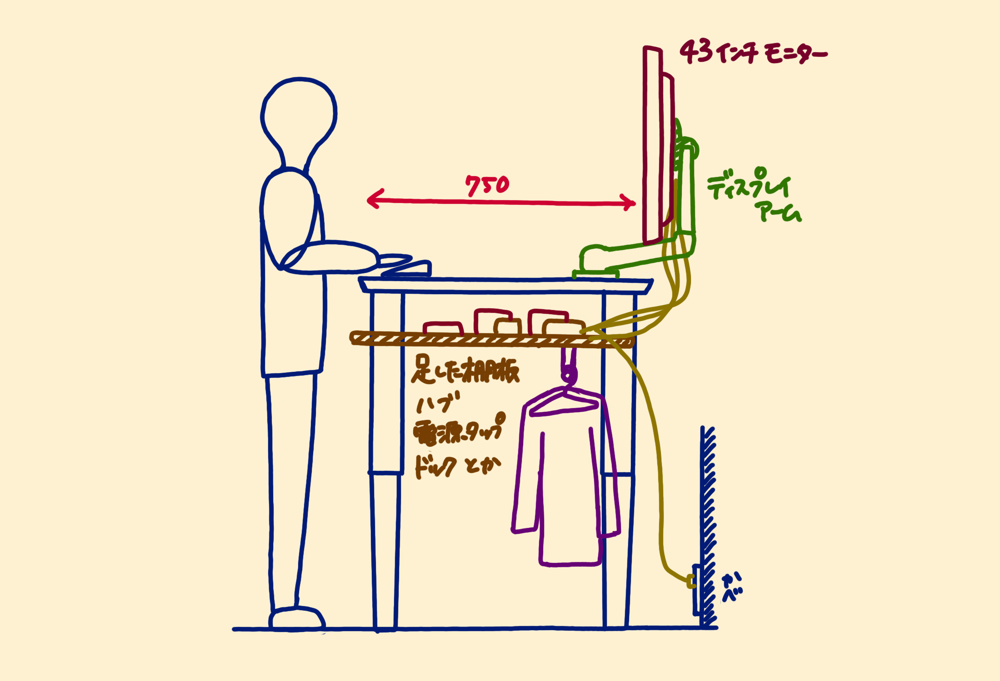
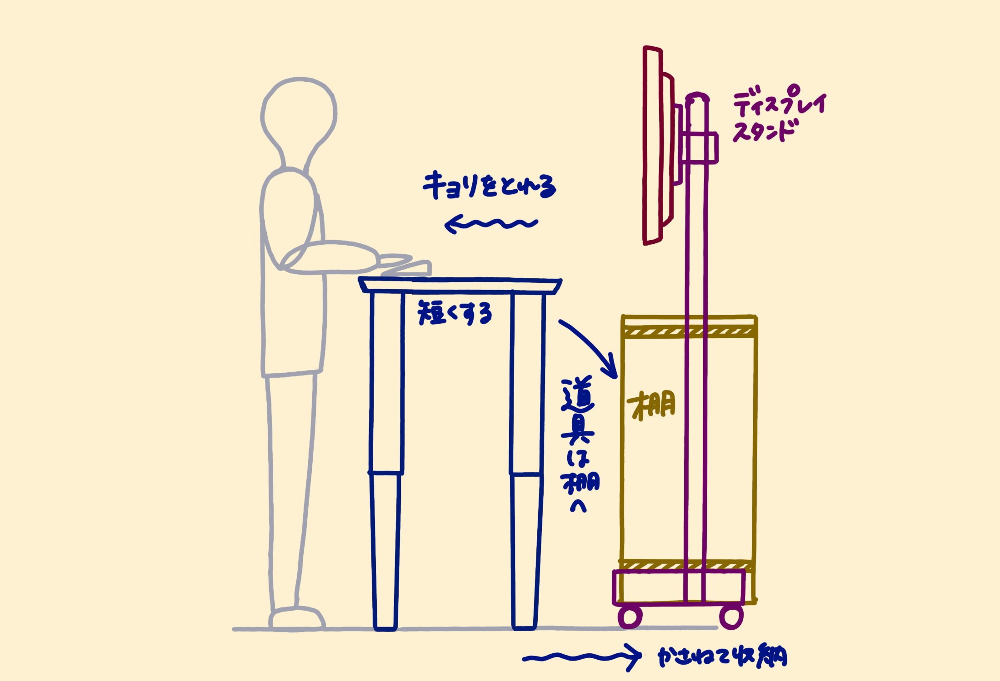
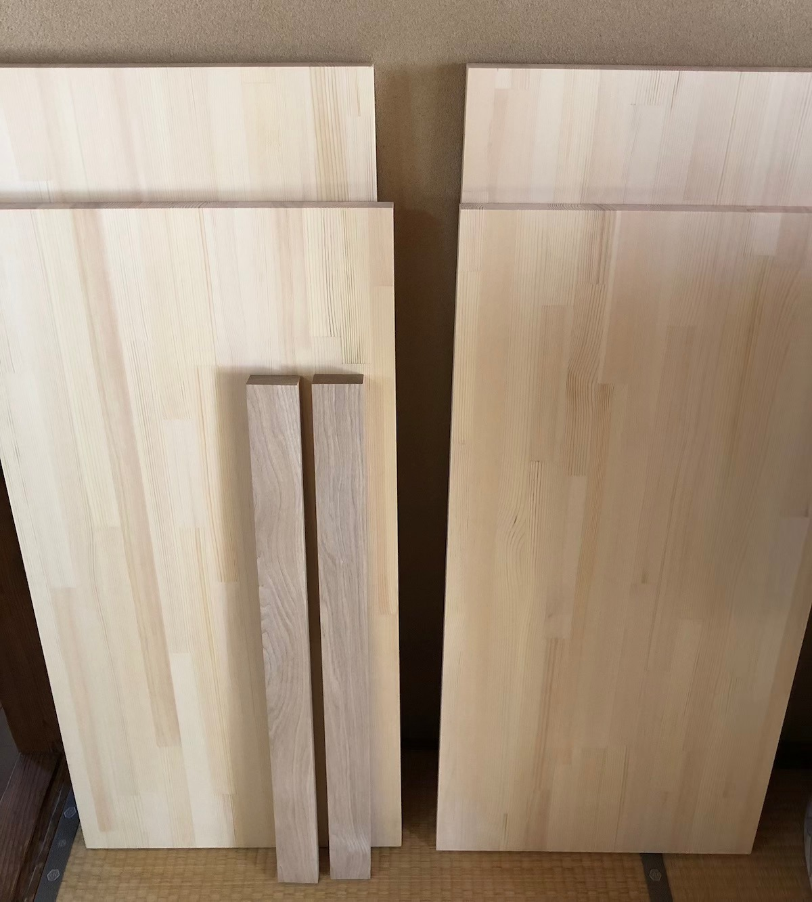
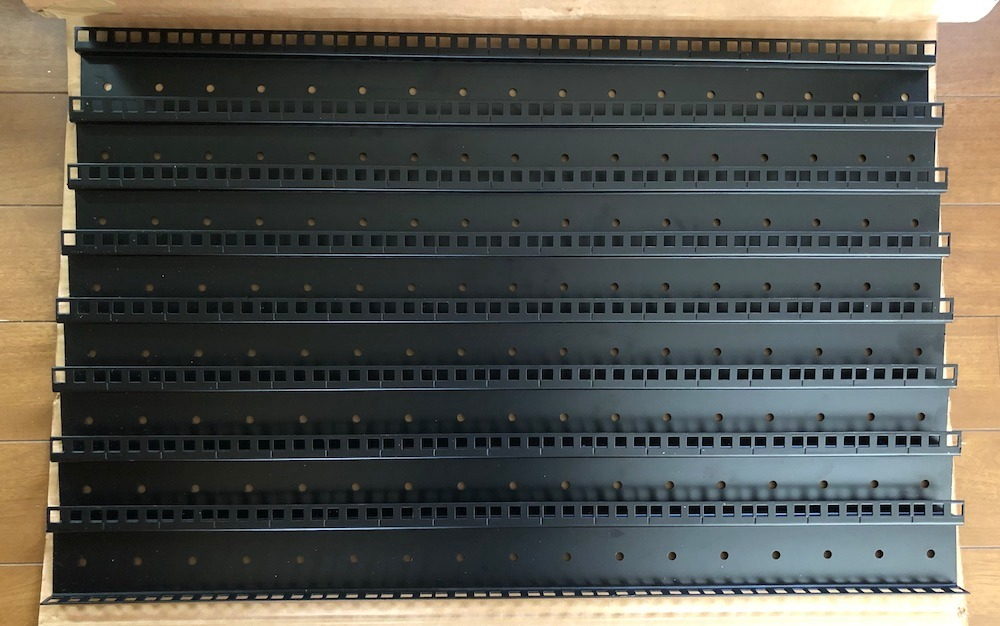
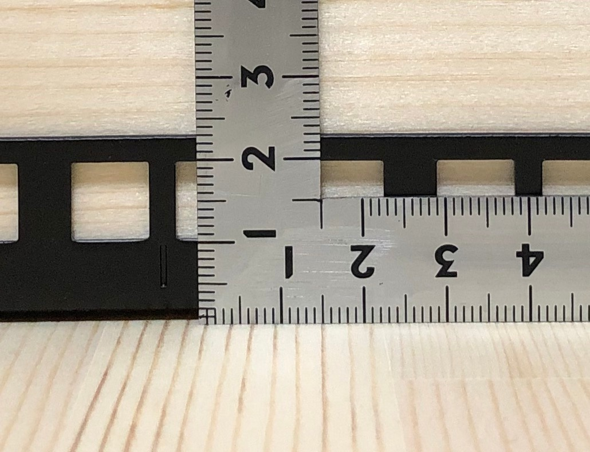
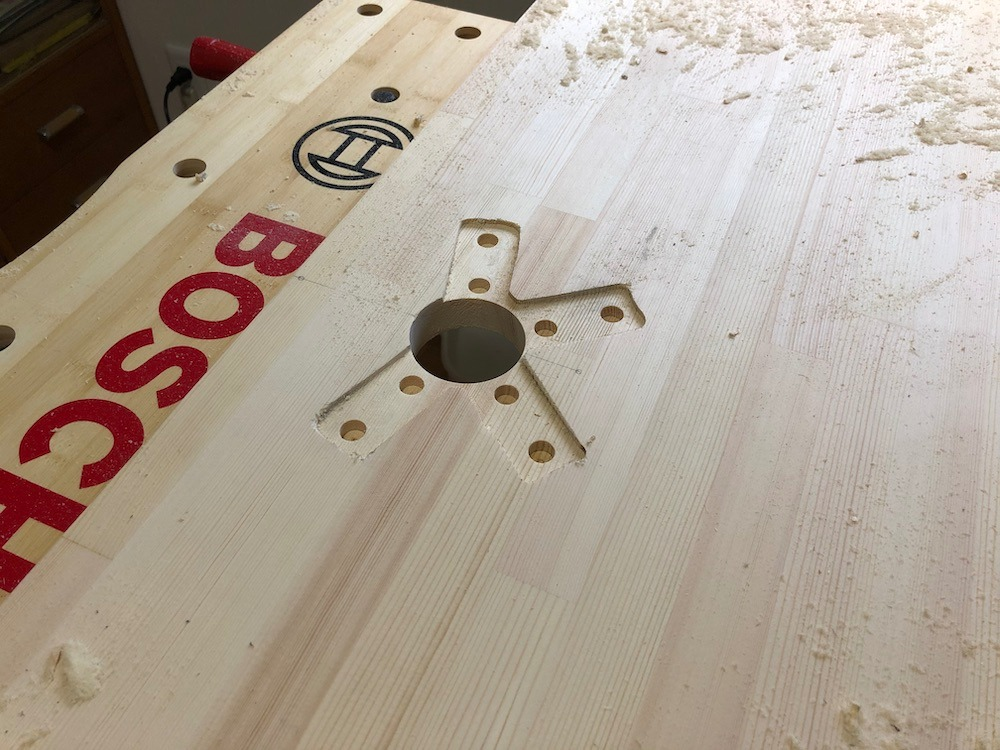
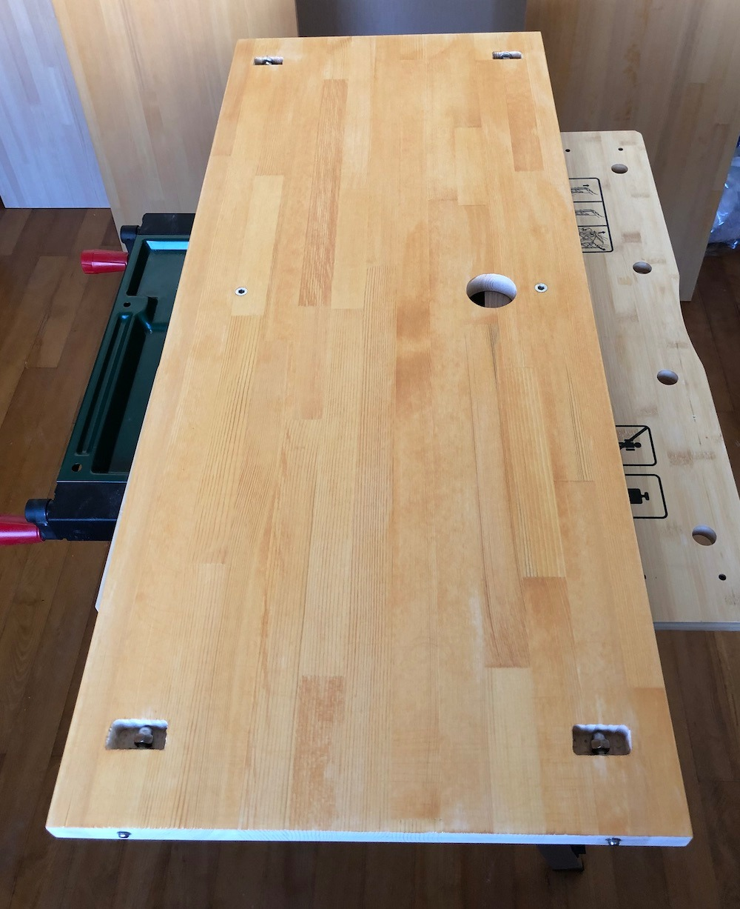
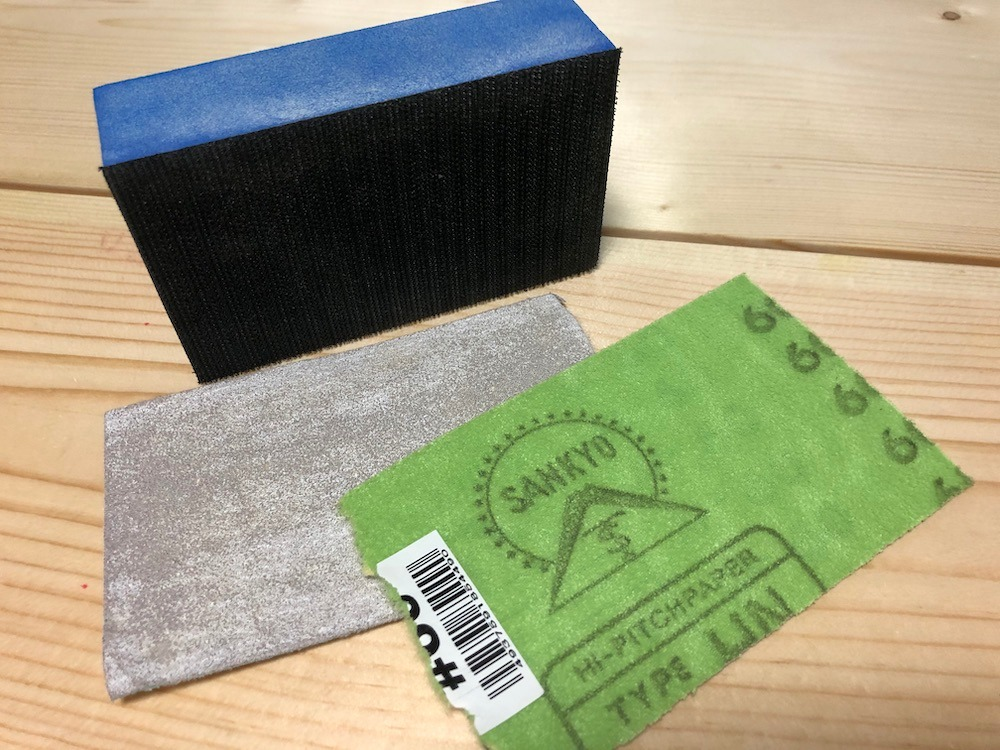
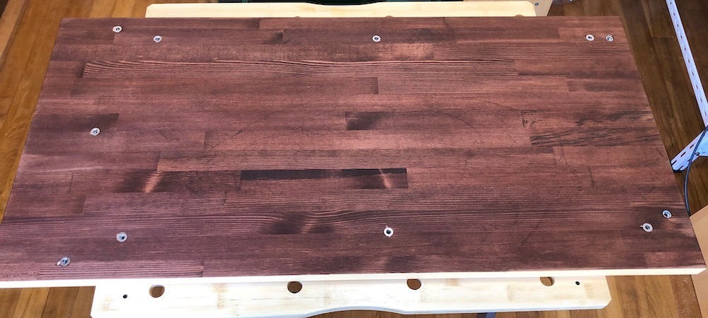
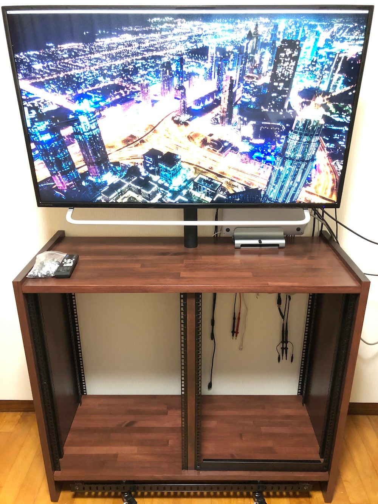

# モニタースタンドに棚をつけるDIY記録

これまでは大きな机にモニターアームと棚板を増築することで快適を求めてきましたが、机が大きな空間を占めることによる窮屈を解決したくなったためリフォームすることにしました。

これまでの状況だと机の増築が過ぎて身動きが取りづらいです。モニターが4Kになり支えているアームがプルプルするのも問題です。

次の画像が改修計画です。スタンドを買って棚を足して道具を収納します。

最終的に板に穴を開けてポールを貫通させることにしました。幅は19インチラックのアクセサリーが使えるように設定しました。

## 木材を買う

[マルトクショップさん](https://shop.woodworks-marutoku.com/)で注文しました。ノースパイン集成材4枚とタモ無垢材2本で21,640円でした。

| 材 | サイズ | 加工 | 個数 | 金額 |
|:----:|:----:|:----:|----:|----:|
|ノースパイン集成材|$$25\times450\times936$$|糸面＋磨き|$$2$$|$$8,040$$円|
|ノースパイン集成材|$$25\times420\times1060$$|穴あけ$$\phi51, 56$$|$$2$$|$$9,580$$円|
|タモ無垢材|$$25\times55\times756$$|糸面＋磨き|$$2$$|$$2,940$$円|
|送料|-|-|-|$$1,080$$円|

## 金具を買う

ラックレールを4ペア（8本）使って2列の19インチラックにします。画像は[17U Steel Rack Rail](https://www.starcase.com/product_p/z17u.htm)から引用しています。

国内のショップを探しても1ペア10,000円以上のものしか見つからなかったので[US-BUYERさん](https://www.us-buyer.com/)経由で[STAR CASE](https://starcase.com/)さんから購入しました。ケージナットも追加して補償サービス付きで送っていただき37,254円になりました。思ったよりかかってしまった。

|商品|個数|金額|
|:----:|:----:|----:|
|Z17U（金具）|4ペア|$$\$158.72$$|
|RFCN50（ケージナット）|1袋|$$\$18.49$$|
|米国内送料|-|$$\$33.80$$|
|手数料|-|$$\$26.58$$|
|補償サービス|-|$$\$6.28$$|
|関税・消費税等|-|$$\$11.28$$|
|日本への送料|-|$$\$63.84$$|

[商品ページ](https://www.starcase.com/product_p/z17u.htm)の寸法だと穴の中心は設置面から13.56mmだと思ったのですが、測ったら15mmでした。1.5x両側x2列 = 6mmも幅を広げないといけなくなりましたが、木材を間違えて50mm大きく注文していたのでなんとかなりました。切る前に気づけてよかった。

## 木材を加工する

[モニタースタンド](https://www.amazon.co.jp/gp/product/B07BDK1QJY/)は4本に分かれた脚からボルトの頭が飛び出しているため、干渉しないように下側の板の裏側を掘っておきます。

天板は表を綺麗なまま固定したいので横向きに開けた穴に寸切りを通して袋ナットで止めました。

横の板は適宜鬼目ナットを埋めました。

## 塗装する

よく研磨して塗装します。

ワシンポアーステインのメープル（2倍希釈）で黄色をつけてからチェスナット（2倍希釈）を2回塗って着色しました。サンディングシーラーを塗って磨いてを3回、水性つやありクリアのニスを2回、最後に水性つや消しクリアのニスを1.5倍に薄めて塗りました。

## 追記

[ラックマウントPCが入居しました。](../../2020/new-computer/index.page.md)
