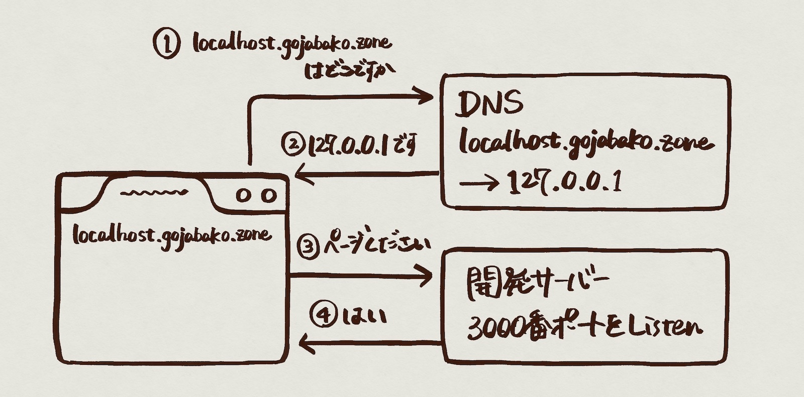
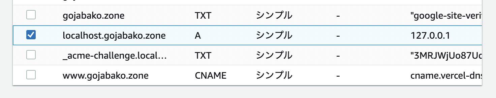
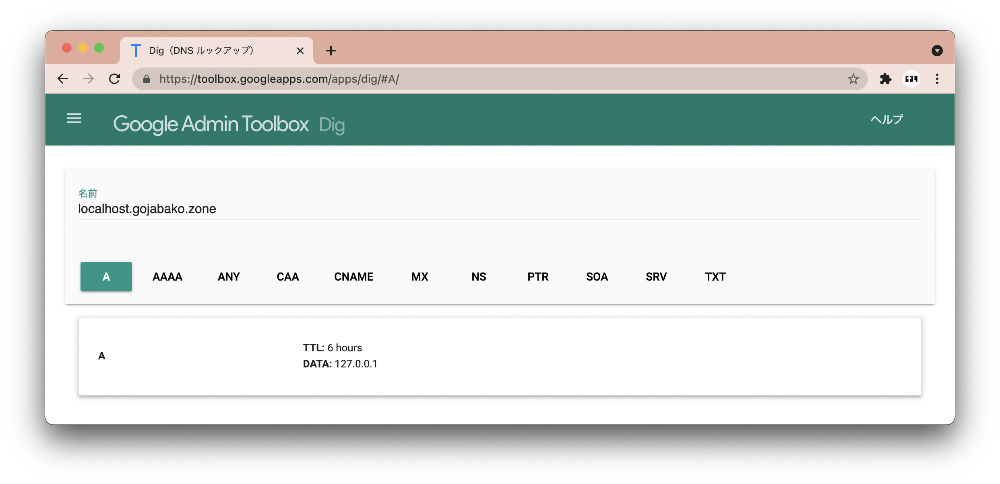
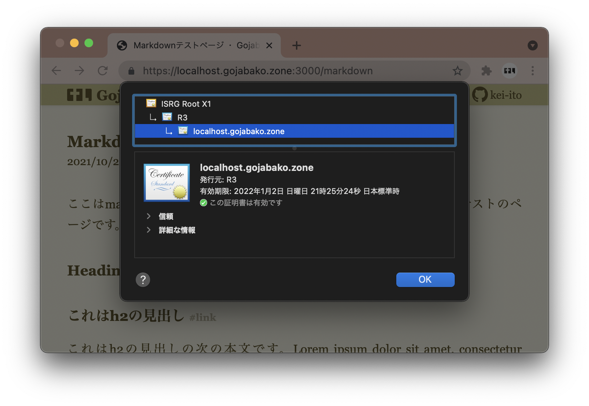

# Next.jsの開発環境をHTTPSにしました

このサイトのコンテンツは主にこういう文章だと思っていますが、この環境をブログ専用にしておくのはもったいないです。アプリが作りたくなって[Clipboard API]とかHTTPSが前提のAPIが必要になる可能性を考えるとHTTPSで開発できるようにしておいて損はないはず。やりましょう。

[Clipboard API]: https://developer.mozilla.org/en-US/docs/Web/API/Clipboard_API

## やりたいこと

1. https://localhost.gojabako.zone:3000 で開発中のページを見る
    1. DNSはlocalhost.gojabako.zoneに127.0.0.1を返す
    1. ブラウザは127.0.0.1:3000にリクエストする
    1. ローカルで3000をlistenしているサーバーがコンテンツを返す
1. 証明書はcertbot (Let's encrypt)でつくる



## DNSにレコードを追加する

localhost.gojabako.zoneのAレコードを127.0.0.1にします。私の場合ドメインはRoute53なので管理コンソールでやりました。



[Google Admin Toolbox](https://toolbox.googleapps.com/apps/dig/#A/)で確認するとこうなっています。



## 証明書をつくる

certbotで作りました。

```sh certbotのコマンド
sudo certbot certonly \
    --manual \
    --domain localhost.gojabako.zone \
    --preferred-chain "ISRG Root X1" \
    --preferred-challenges dns
```

表示される値を_acme-challenge.localhost.gojabako.zoneのTXTレコードに設定してEnterを押すと証明書ができます。

```txt 証明書の場所 (macOS, certbot 1.19.0)
/etc/letsencrypt/live/localhost.gojabako.zone/README
/etc/letsencrypt/live/localhost.gojabako.zone/cert.pem
/etc/letsencrypt/live/localhost.gojabako.zone/chain.pem
/etc/letsencrypt/live/localhost.gojabako.zone/fullchain.pem
/etc/letsencrypt/live/localhost.gojabako.zone/privkey.pem
```

でもここから読むのはsudoが必要で手間なのでプロジェクトの中にコピーします。秘密鍵はそのままだと読めないのでコピー後に権限をつけます。[.gitignore]で*.pemをコミットしないようにしているので[GitHubではREADMEだけがある](https://github.com/kei-ito/gojabako.zone/tree/main/certificates/localhost.gojabako.zone)状態になっています[^1]。

```sh コピーと権限付与のコマンド
sudo cp /etc/letsencrypt/live/localhost.gojabako.zone certificates
sudo chmod +r certificates/localhost.gojabako.zone/privkey.pem
```

[^1]: この用途の証明書を公開したら何かまずいかな？GitHubとか[GitGuardian]の警告が飛んできそうではあります。

[.gitignore]: https://github.com/kei-ito/gojabako.zone/blob/main/.gitignore
[GitGuardian]: https://www.gitguardian.com/

## server.mjsをつくる

`next dev`のサーバーだと作った証明書ファイルを渡す方法がないので[カスタムサーバー]が必要になります。

[カスタムサーバー]: https://nextjs.org/docs/advanced-features/custom-server

```javascript server.mjs
import * as fs from 'fs';
import * as https from 'https';
import * as console from 'console';
import * as url from 'url';
import next from 'next';

const rootUrl = new URL('https://localhost.gojabako.zone:3000');
const [key, cert] = await Promise.all([
    fs.promises.readFile('certificates/localhost.gojabako.zone/privkey.pem')),
    fs.promises.readFile('certificates/localhost.gojabako.zone/fullchain.pem')),
]);
const server = https.createServer({key, cert});
const app = next({dev: process.env.NODE_ENV !== 'production'});
await app.prepare();
const handleApiRequest = app.getRequestHandler();
server.on('request', (req, res) => {
    const parsedUrl = url.parse(new URL(req.url, rootUrl).href, true);
    // queryがnullだとhandleApiRequestがエラーになるので{}で埋めます
    parsedUrl.query = parsedUrl.query || {};
    if (req.url.startsWith('/api/')) {
        handleApiRequest(req, res, parsedUrl);
    } else {
        app.render(req, res, parsedUrl.pathname, parsedUrl.query);
    }
});
server.once('error', (error) => {
    console.error(error);
});
server.on('listening', () => {
    console.info(`> Ready on ${rootUrl}`);
});
server.listen(rootUrl.port);
```

## package.jsonの修正

`next dev`を`server.mjs`の実行に変えます。これで`npm run dev`でHTTPSのサーバーが起動します。

```json
"scripts": {
    "dev": "node server.mjs"
}
```

localhost.gojabako.zone:3000をHTTPSで表示できます。



## 別の端末から見たいです

サーバーを動かしている端末以外から開発画面を見る場合はhostsを編集してlocalhost.gojabako.zoneがサーバーを向くようにしましょう。
