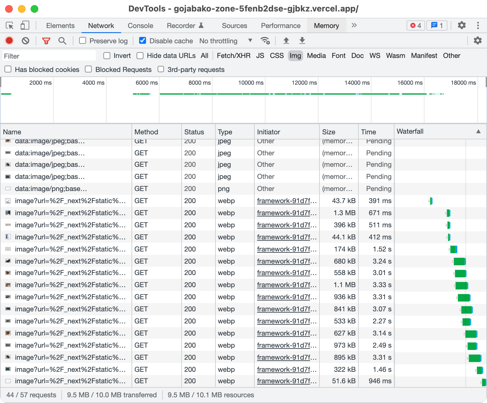

# next/imageが遅いのでやめた

[iPadケースを作った記事](../../2021/ipad-case/index.page.md)の画像が読み込みに2秒以上かかることがあり閲覧に支障があったため改善したまとめです。



[next/image](https://nextjs.org/docs/api-reference/next/image)は画像を調整してくれるのはいいのですが、元の画像が3MBくらいでキャッシュがないと表示まで3秒くらいかかっていました。ここは私の個人サイトなので編集がなければコンテンツは変わらないので、事前にいい具合のサイズの画像を生成しておいてブラウザに選択させるようにしました。実装した機能は以下の通りです。

1. srcとpublicの画像を列挙する
2. それぞれについて 幅(300, 400, ..., 1800) × 形式(オリジナル, webp, avif) の画像を生成する
   - 例えば 幅(300, 400, 800) × 形式(jpeg, webp, avif) なら9種類
3. 生成した画像の一覧を使って `{元ファイル}.component.tsx` を生成する（このファイルは.gitignoreする）
4. 画像がすでに生成してあれば省略する（.gitignoreしてるのでコンポーネントの生成は毎度やる）

`{元ファイル}.component.tsx`は例えばこんな感じです。

```tsx 生成されるコンポーネントの例
import type {DetailedHTMLProps, ImgHTMLAttributes} from 'react';
const Image = (
  props: DetailedHTMLProps<ImgHTMLAttributes<HTMLImageElement>,
) => <picture style={{aspectRatio: '1526/1266'}}>
  <source srcSet="/images/v1/Qb2kzaQ4/300w.webp 300w, /images/v1/Qb2kzaQ4/400w.webp 400w, /images/v1/Qb2kzaQ4/500w.webp 500w, /images/v1/Qb2kzaQ4/600w.webp 600w, /images/v1/Qb2kzaQ4/800w.webp 800w, /images/v1/Qb2kzaQ4/1000w.webp 1000w, /images/v1/Qb2kzaQ4/1200w.webp 1200w, /images/v1/Qb2kzaQ4/1500w.webp 1500w" type="image/webp" />
  <source srcSet="/images/v1/Qb2kzaQ4/300w.avif 300w, /images/v1/Qb2kzaQ4/400w.avif 400w, /images/v1/Qb2kzaQ4/500w.avif 500w, /images/v1/Qb2kzaQ4/600w.avif 600w, /images/v1/Qb2kzaQ4/800w.avif 800w, /images/v1/Qb2kzaQ4/1000w.avif 1000w, /images/v1/Qb2kzaQ4/1200w.avif 1200w, /images/v1/Qb2kzaQ4/1500w.avif 1500w" type="image/avif" />
  
</picture>;
export default Image;
```

この対策により表示にかかる時間（の最大値）は3,000msから200ms以下になりました。


## 訂正

このツイートの50msはおそらく`x-vercel-cache: HIT`のを見ているので正しくないです。

```twitter
<blockquote class="twitter-tweet"><p lang="ja" dir="ltr">複数サイズのwebpとavifを生成しておいて&lt;picture&gt;と&lt;source&gt;と&lt;img&gt;で出すようにした<br>→ 50ms以内で出てるので目標は達成<br>画像読み込み完了時の描画ずれは&lt;picture&gt;へのaspect-ratioで対応できたけどスクロールした状態で再読み込みすると数pxずれる <a href="https://t.co/aOyLrcEfW7">pic.twitter.com/aOyLrcEfW7</a></p>&mdash; Kei Ito (@gjbkz) <a href="https://twitter.com/gjbkz/status/1489839390327447553?ref_src=twsrc%5Etfw">February 5, 2022</a></blockquote> <script async src="https://platform.twitter.com/widgets.js" charset="utf-8"></script>
```

## 参考文献

1. MDN Web Docs
   1. [`<picture>`: The Picture element](https://developer.mozilla.org/en-US/docs/Web/HTML/Element/picture)
   2. [`<source>`: The Media or Image Source element](https://developer.mozilla.org/en-US/docs/Web/HTML/Element/source)
   3. [``: The Image Embed element](https://developer.mozilla.org/en-US/docs/Web/HTML/Element/img)
