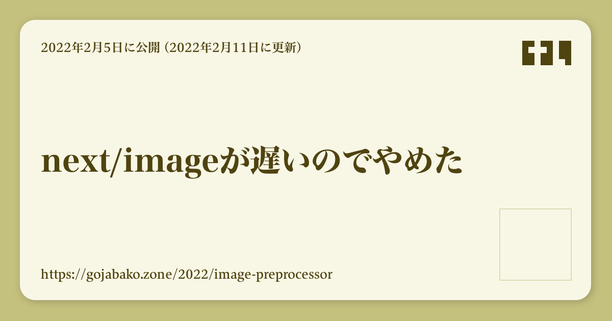

# ブログ記事の画像を生成する

SNSでURLをシェアしたときに表示されるページ情報に画像があるとかっこいいのでできるようにしました。

```twitter
<blockquote class="twitter-tweet"><p lang="ja" dir="ltr">画像表示のテスト<a href="https://t.co/YRGuXME8dI">https://t.co/YRGuXME8dI</a></p>&mdash; Kei Ito (@gjbkz) <a href="https://twitter.com/gjbkz/status/1492117271346823173?ref_src=twsrc%5Etfw">February 11, 2022</a></blockquote> <script async src="https://platform.twitter.com/widgets.js" charset="utf-8"></script>
```

これを書いている時点の記事画像はこのような感じです。右下の枠にはURLのQRコードを表示する予定です。



2/12追記: タイトルが目立つようにデザインを修正しました。


## 画像の生成方法

画像に含めている情報は以下の通りです。

1. 記事のタイトル
2. 記事の作成日と更新日
3. 記事のURL

これらはページのmetaタグを入れるためにこのような形でデータを用意してありました。

```typescript [/src/pageList.ts#L3-L10](https://github.com/gjbkz/gojabako.zone/blob/49482751596fc3b46bbaf7086b374a2eeec83c4e/src/pageList.ts#L3-L10)
export interface PageData {
    pathname: string,
    title: string,
    filePath: string,
    publishedAt: string,
    updatedAt: string,
    commitCount: number,
}
```

これを[node-canvas]でPNG出力します。

[node-canvas]: https://github.com/Automattic/node-canvas

## 背景の影

画像の枠についている影は[StackBlur]を使っています。

[StackBlur]: https://github.com/flozz/StackBlur

```typescript [/packages/page/generatePageImage.ts#L88-L94](https://github.com/gjbkz/gojabako.zone/blob/49482751596fc3b46bbaf7086b374a2eeec83c4e/packages/page/generatePageImage.ts#L88-L94)
/** 影の四角を描いて */
ctx.fillStyle = 'rgba(0,0,0,0.2)';
drawRoundedRect(ctx, x + 2, y + 2, w, h, borderRadius);
ctx.fill();
/** まるごとぼかして */
stackBlur.canvasRGB(ctx.canvas, 0, 0, width, height, blurRadius);
/** 枠を書く */
ctx.fillStyle = colors.background;
drawRoundedRect(ctx, x - 1, y - 1, w, h, borderRadius);
ctx.fill();
```

## 改行位置の調整

フォントサイズが60pxだと日本語で17文字で横幅いっぱいになります。文字を小さくするのは読みにくいので長いタイトルの場合は改行することにしたのですが、看板のようなものなのでたとえ<br/>ばこのような位置で改<br/>行されると格好が悪いです。

文節を切らないように改行位置を決めればいい具合になります。今回は[Kuromoji]を使って以下のような禁則処理を実装をしました。

[Kuromoji]: https://github.com/takuyaa/kuromoji.js

1. 助詞、助動詞の前では改行しない
2. 開き括弧の後ろでは改行しない
3. 閉じ括弧の前では改行しない
4. 句読点の前では改行しない
5. 数字の後ろでは改行しない（"10cm"など単位を想定しています）

例えば「今日の8時からNext.jsの話をします」の場合は以下のスラッシュの位置でのみ改行します。<br/>
「今日の/8時から/Next.jsの/話を/します」


## はみ出し対策

タイトルが長いとはみ出してしまうので行がはみ出す場合はフォントを小さくしてリトライするようにしました。QRコード部分に重ならないように改行位置も調整しています。


## 課題

QRコード表示を実装して右下の謎の枠をなんとかしないといけません。
