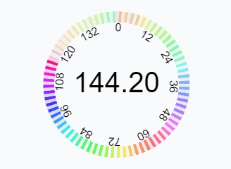

# デバイス情報の確認

画面の大きさやフレームレートが気になったときに確認するためのページです。

## スクリーンの大きさと位置

スクリーンとブラウザアプリ、ビューポートの位置関係を表示します。画面上でブラウザを動かしたり大きさを変えたりするとそれに合わせて動きます。

```jsx (include)
import {ScreenInspector} from '../../../components/ui/ScreenInspector';
/****************/
<ScreenInspector/>
```

ブラウザのタブ部分の大きさを得るのにPointerEventを使っています。このページ上でマウスかタッチのイベントがあるまではブラウザのタブ部分（ある場合）の大きさが正しく得られません。マウス等のイベントを使わずに解決する方法をご存じでしたら教えてほしいです。以下のコードで得られる`viewportAppX`はたいていゼロですが、Yの方はWindowsのChromeだとウインドウが最大化されていると71、そうでなければ80になっていました。


```typescript
/** スクリーン左端からイベントまで */
const eventScreenX = pointerEvent.screenX;
/** ビューポート左端からイベントまで */
const eventViewportX = pointerEvent.clientX;
/** スクリーン左端からビューポート左端まで */
const viewportScreenX = eventScreenX - eventViewportX;
/** スクリーン左端からブラウザアプリの左端まで */
const appScreenX = globalThis.screenX;
/** ブラウザアプリの左端からビューポート左端まで */
const viewportAppX = viewportScreenX - appScreenX;
```

## フレームレート

```jsx (include)
import {FrameRateInspector} from '../../../components/ui/FrameRateInspector';
/****************/
<FrameRateInspector/>
```

クルクルは1秒で1回転です。色の濃淡ごとに2フレームです（濃で1フレーム、淡で1フレーム）。フレームレートが高ければ濃淡が細かくなります。


